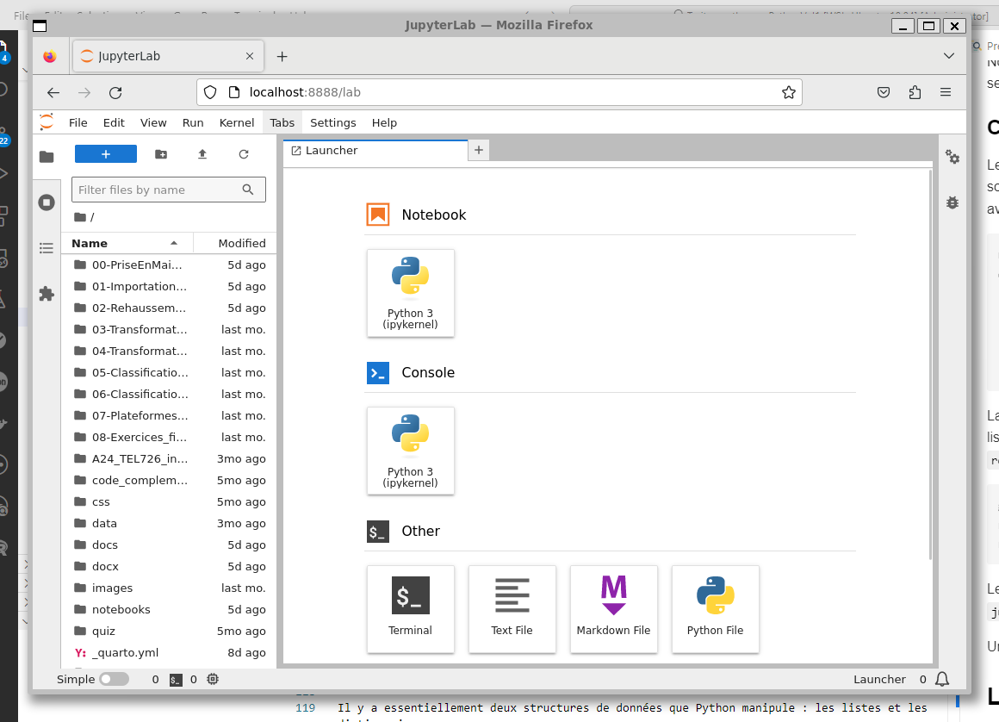

# Introduction au langage Python {#sec-chap00}

Dans ce chapitre, nous présentons quelques éléments essentiels du langage Python qui nous seront utiles dans ce manuel. Python est un langage très riche et peut aboutir à des projets logiciels très sophistiqués. Il est important de comprendre que la programmation Python n'est pas ici une fin en soi, mais plutôt un outil de scriptage et de manipulation des données satellitaires.

:::::: bloc_objectif
:::: bloc_objectif-header
::: bloc_objectif-icon
:::

**Objectifs d'apprentissage visés dans ce chapitre**
::::

::: bloc_objectif-body
À la fin de ce chapitre, vous devriez être en mesure de :

-   connaître les principales distributions de Python;
-   installer un environnement d'exécution du code de cet ouvrage;
-   comprendre les structures de base du langage Python (listes, tuples, ensembles, dictionnaires);
-   écrire des boucles, des conditions et des fonctions;
-   aborder la programmation orientée objet;
-   organiser du code en modules et packages;
-   manipuler une matrice `NumPy`.
:::
::::::

Ce chapitre est aussi disponible sous la forme d'un notebook Python sur Google Colab :

[](https://colab.research.google.com/github/sfoucher/TraitementImagesPythonVol1/blob/main/notebooks/00-PriseEnMainPython.ipynb)

Python, créé par [Guido van Rossum](https://en.wikipedia.org/wiki/Guido_van_Rossum) en 1991, est un langage de programmation polyvalent et facile à apprendre, souvent comparé à un couteau suisse numérique pour sa simplicité et sa polyvalence. Comme un outil multifonction, Python peut être utilisé pour une variété de tâches, du développement web à l'analyse de données, en passant par l'intelligence artificielle.

## Les distributions

Il existe plusieurs [distributions](https://wiki.python.org/moin/PythonDistributions) du langage Python, ces distributions sont des variantes plus ou moins volumineuses - chacune a ses propres caractéristiques uniques, mais elles sont toutes fondamentalement Python. Voici un aperçu des principales distributions :

| Distribution | Description | Idéale pour |
|------------------------|------------------------|------------------------|
| [CPython](https://www.python.org/downloads/) | L'implémentation officielle « vanille » | La compatibilité et la conformité aux standards |
| [Anaconda](https://www.anaconda.com/download) | Livrée avec de nombreuses bibliothèques scientifiques | L'analyse de données et l'apprentissage automatique (*machine learning*) |
| [Miniconda](https://docs.anaconda.com/miniconda/miniconda-install/) | Version légère ; on ajoute les bibliothèques au besoin | Un environnement minimal et contrôlé |
| [PyPy](https://pypy.org/) | Implémentation optimisée pour la vitesse d'exécution | Les programmes gourmands en calcul |

Chaque distribution a ses forces, que ce soit la simplicité, la vitesse ou des fonctionnalités spécifiques. Le choix dépend donc de vos besoins, la version Anaconda est par exemple très volumineuse et contiendra la plupart des librairies de base (Numpy, Scikit, etc.). Au contraire, Miniconda ne contient que le cœur de Python et les librairies seront ajoutées une par une au besoin.

## Les styles de programmation en Python

Il existe plusieurs approches pour programmer en Python. La plus directe est en version interactive en tapant `python` et de rentrer des commandes ligne par ligne. On parle de mode REPL (“Read-Eval-Print Loop”) ou l'interpréteur Python vous donne une rétroaction immédiate commande par commande.

### Les outils de programmation

Un code python prend la forme d'un simple fichier texte avec l'extension `.py` et peut être modifié avec un simple éditeur de texte. On parle alors de *script* Python. Cependant, il n'y aura pas de rétroactions immédiates de l'interpréteur Python, ce qui rend la correction d'erreurs (débogage) beaucoup plus laborieux.

Un IDE (*Integrated Development Environment*) est comme une boîte à outils complète pour les programmeurs, vous trouverez :

-   Un éditeur de texte amélioré pour écrire votre code, avec des fonctionnalités comme la coloration syntaxique qui rend le code plus lisible.

-   Un interpréteur qui exécute votre code ligne par ligne.

-   Un débogueur pour trouver et corriger les erreurs, tel un détective numérique.

-   Des outils d'automatisation qui effectuent des tâches répétitives, comme un assistant virtuel pour le codage.

-   L'accès à la documentation des différentes librairies.

Ces outils intégrés permettent aux développeurs de travailler plus efficacement, en passant moins de temps à jongler entre différentes applications et plus de temps à produire du code.

Voici quelques options populaires :

| Outil | Type | Points forts |
|------------------------|------------------------|------------------------|
| [PyCharm](https://www.jetbrains.com/pycharm/) | IDE complet | Autocomplétion, débogage intégré ; idéal pour les grands projets (gourmand en ressources) |
| [Visual Studio Code](https://code.visualstudio.com/) | Éditeur extensible | Gratuit, léger, personnalisable par extensions |
| [Spyder](https://www.spyder-ide.org/) | IDE scientifique | Libre et gratuit, orienté calcul scientifique |
| [Jupyter](https://jupyter.org/) | Notebook | Mélange code, texte et visualisations ; gratuit sur Colab/Kaggle (reproductibilité limitée) |
| [Marimo](https://marimo.io/) | Notebook réactif | Réexécute automatiquement les cellules dépendantes ; évite l'état caché |

### Le principe du serveur Jupyter et des notebooks

Les chapitres de ce livre sont fournis sous forme de *notebooks* (carnets), le format le plus répandu pour l'analyse de données scientifiques. Un **notebook** est un fichier (extension `.ipynb`) organisé en **cellules** que l'on exécute une à une :

-   des cellules de **code** Python, dont le résultat (texte, tableau, figure) s'affiche juste en dessous ;
-   des cellules de **texte** (Markdown) pour la documentation, les titres et les équations.

On peut ainsi entrelacer le code, les explications et les résultats dans un même document, ce qui en fait un excellent outil pédagogique et un support d'analyse reproductible.

Un notebook repose sur une **architecture client-serveur** en trois pièces :

1.  Le **serveur Jupyter** est un programme lancé sur votre machine (ou dans le nuage). Il gère les fichiers de notebooks et fait le pont entre l'interface et le moteur de calcul.
2.  L'**interface** s'affiche dans un simple navigateur web : c'est là que vous éditez et lancez les cellules. Aucune installation supplémentaire n'est requise côté affichage.
3.  Le **noyau** (*kernel*) est le processus Python qui exécute réellement le code. Il **conserve l'état en mémoire** entre les cellules : une variable définie dans une cellule reste disponible dans les suivantes.

Quand vous exécutez une cellule, l'interface envoie le code au serveur, qui le transmet au noyau ; le noyau calcule puis renvoie le résultat, affiché sous la cellule. Comme le noyau garde l'état, l'**ordre d'exécution** des cellules compte : réexécuter des cellules dans le désordre peut mener à un état incohérent. En cas de doute, on redémarre le noyau et on réexécute tout depuis le début (menu *Kernel*, puis *Restart & Run All*).

Le service [Google Colab](https://colab.google/) fournit gratuitement ce trio (serveur, interface, noyau) dans le nuage : c'est la façon la plus simple d'ouvrir les notebooks du livre sans rien installer. Pour travailler localement, il faut lancer soi-même un serveur Jupyter (voir @sec-00-jupyter-local plus bas).

## Bonnes pratiques

Python est un langage très dynamique, qui évolue constamment. Cela pose certains défis pour la gestion du code à long terme. Il est fortement conseillé d'utiliser des environnements virtuels pour gérer vos différentes bibliothèques (*libraries*). Voici quelques bonnes pratiques à suivre :

1.  **N'installez pas la toute dernière version de Python** : Il est recommandé d'installer 1 ou 2 version antérieure, par exemple si 3.13 est [la version plus récente](https://www.python.org/downloads/), installer plutôt la version 3.11. Les versions trop récentes peuvent être instables surtout au niveau des librairies. La version de python désirée peut être spécifiée au moment de la création d'un environnement virtuel (voir plus bas). Vous pouvez afficher la liste des versions de python avec la commande `conda search --full-name python`.

2.  **N'utilisez pas de version obsolète de Python**. Cela peut sembler contradictoire avec le point précédent mais c'est l'excès inverse. Si vous utilisez une version trop ancienne alors toutes vos librairies cesseront d'évoluer et peuvent devenir obsolètes.

3.  **Utilisez des environnements virtuels**. Pensez-y comme à des compartiments séparés pour chaque projet. Cela évite les conflits entre les différentes versions de bibliothèques (*libraries*) et garde votre système propre. Par exemple, si vous souhaitez vérifier une nouvelle version de Python, utilisez un environnement : `conda create --name test python=3.11`

4.  **Vérifiez l'installation**. Après l'installation, ouvrez un terminal et tapez `python --version` pour vous assurer que tout fonctionne correctement.

### Création d'un environnement virtuel {#sec-00-01}

Il y a deux façons d'installer un environnement virtuel selon votre distribution de Python:

1.  **Option 1**. Vous utilisez [Anaconda](https://www.anaconda.com/download) ou [Miniconda](https://docs.anaconda.com/miniconda/miniconda-install/). La commande `conda` est utilisée pour créer un environnement test avec Python 3.10:

``` bash
conda create -n test python=3.10
conda activate test
```

2.  **Option 2**. Vous utilisez [CPython](https://www.python.org/downloads/), sans `conda`. Le module `venv` de la bibliothèque standard crée l'environnement et `pip` installe ensuite les bibliothèques :

``` bash
python -m venv test
source test/bin/activate       # Windows : test\Scripts\activate
pip install --upgrade pip
```

### Création d'un environnement de travail local (avancé) {#sec-00-jupyter-local}

**Note**: les notebooks peuvent fonctionner localement sous Windows ou sous Linux avec WSL2.

Les notebooks Python fonctionnent par défaut dans l'environnement [Google Colab](https://colab.google/). Si vous souhaitez faire fonctionner ces notebook localement, vous pouvez installer un environnement local avec un serveur [Jupyter](https://jupyterlab.readthedocs.io/en/stable/getting_started/starting.html). Il suffit de suivre les étapes suivantes:

1\. Installer `WSL2` sous [Windows](https://learn.microsoft.com/en-us/windows/wsl/install)

2\. Installer [vscode](https://code.visualstudio.com/docs/setup/windows)

3\. Installer [Miniconda](https://docs.anaconda.com/miniconda/install/#quick-command-line-install)

4\. Faire une installation du contenu du livre soit en utilisant une commande `git clone` ou en récupérant le `.zip` du livre

5\. Ouvrir WSL2 et placer vous dans le répertoire du livre `TraitementImagesPythonVol1`. Assurez vous que vous avez accès à conda en tapant `conda --version`

6\. Lancer la commande `conda env create -f jupyter_env.yaml`

7\. Activer le nouvel environnement: `conda activate jupyter_env`

8\. Le serveur jupyter peut ensuite être lancé avec la commande suivante: `jupyter lab --ip='*' --NotebookApp.token='' --NotebookApp.password=''`

Une fenêtre devrait alors apparaître dans votre fureteur. Dans le menu de gauche vous pouvez accéder aux notebooks dans le répertoire `notebooks`:

{#fig-jupyterlab fig-scap="Client Jupyter Lab" width="100%" fig-align="center"}

## Les structures de base en Python

Python manipule quatre structures de données fondamentales : les listes, les tuples, les ensembles et les dictionnaires.

### Les listes

Les listes sont comme des boites extensibles où vous pouvez ranger différents types d'objets:

-   Représentées par des crochets : `[1, 2, 3, "python"]`.

-   Ordonnées et modifiables (*mutable*), vous pouvez récupérer une valeur par sa position avec `[]`.

-   Permettent les doublons (deux fois la même valeur).

-   Idéales pour stocker des collections d'éléments que vous voulez modifier

```{python}
#| eval: true
# Une liste des bandes spectrales d'une image (analogie télédétection)
bandes = ["bleu", "vert", "rouge", "PIR"]
print(bandes[0])          # premier élément
print(bandes[-1])         # dernier élément
print(bandes[1:3])        # tranche (slice) : ['vert', 'rouge']

bandes.append("SWIR")     # ajout en fin de liste
print(len(bandes), "bandes :", bandes)

# Compréhension de liste : transformer chaque élément
print([b.upper() for b in bandes])
```

### Les tuples

Les tuples sont similaires aux listes, mais les boîtes sont scellées:

-   Représentés par des parenthèses : `(1, 2, 3, "python")`.

-   Ordonnés mais non modifiables (*immutable*).

-   Permettent les doublons.

-   Souvent utilisés pour stocker des données qui ne doivent pas changer (comme des paramètres).

```{python}
#| eval: true
# Les dimensions (lignes, colonnes) d'une image : une donnée qui ne change pas
dimensions = (512, 512)
lignes, colonnes = dimensions        # dépaquetage (unpacking)
print("Lignes :", lignes, "| Colonnes :", colonnes)

# dimensions[0] = 1024   # -> TypeError : un tuple est immuable
```

### Les ensembles (Sets)

Les ensembles sont comme des boites magiques qui ne gardent qu'un exemplaire de chaque objet:

-   Représentés par des accolades : `{1, 2, 3}`.

-   Non ordonnés et modifiables.

-   N'autorisent pas les doublons.

-   Utiles pour éliminer les doublons et effectuer des opérations mathématiques sur des ensembles.

```{python}
#| eval: true
# Éliminer les doublons d'une liste de classes d'occupation du sol
classes = ["eau", "forêt", "eau", "urbain", "forêt"]
uniques = set(classes)
print(uniques)

# Opérations ensemblistes
a, b = {1, 2, 3}, {3, 4}
print("intersection :", a & b, "| union :", a | b)
```

## Dictionnaires

Les dictionnaires sont comme des boites avec des étiquettes sur chacune d'elles :

-   Représentés par des accolades avec des paires clé-valeur : `{"nom": "Python", "année": 1991}`.

-   Non ordonnés et modifiables.

-   Les clés doivent être uniques, mais les valeurs peuvent être dupliquées

-   Utiles pour stocker des données associatives ou pour créer des tables de recherche rapide

```{python}
#| eval: true
# Un dictionnaire : les métadonnées d'une image satellite
image = {"capteur": "Sentinel-2", "bandes": 13, "resolution_m": 10}
print(image["capteur"])              # accès par clé

image["date"] = "2024-07-01"         # ajout d'une paire clé-valeur
for cle, valeur in image.items():    # parcours des paires clé-valeur
    print(f"{cle} : {valeur}")
```

:::::: bloc_aller_loin
:::: bloc_aller_loin-header
::: bloc_aller_loin-icon
:::

**Les opérateurs `*` et `**` sur un dictionnaire**
::::

::: bloc_aller_loin-body
Les opérateurs de *déballage* (*unpacking*) donnent accès au contenu d'un dictionnaire sans écrire de boucle. La règle est simple : `**` déballe les **paires clé-valeur**, tandis que `*` (une seule étoile) ne déballe que les **clés**.

``` python
image = {"capteur": "Sentinel-2", "bandes": 13, "resolution_m": 10}

# ** : fusionner ou copier des dictionnaires
complet = {**image, "date": "2024-07-01"}   # copie + une paire en plus
fusion  = {**image, "bandes": 4}            # en cas de collision, la dernière clé gagne

# ** : passer un dictionnaire comme arguments nommés d'une fonction
def resume(capteur, bandes, resolution_m):
    return f"{capteur} : {bandes} bandes à {resolution_m} m"

print(resume(**image))          # équivaut à resume(capteur="Sentinel-2", bandes=13, ...)

# * : ne déballe que les clés
print([*image])                 # ['capteur', 'bandes', 'resolution_m']
print(*image, sep=", ")         # capteur, bandes, resolution_m

# Côté définition d'une fonction : **kwargs collecte les arguments nommés dans un dict
def info(**meta):               # meta est un dictionnaire
    for cle, valeur in meta.items():
        print(cle, ":", valeur)

info(capteur="SPOT", bandes=4)
```

À retenir : `**d` sert à *fournir* ou *fusionner* des paires clé-valeur (appels de fonction, construction de dictionnaires), alors que `**kwargs` dans une **définition** de fonction fait l'inverse — il *collecte* les arguments nommés dans un dictionnaire. À partir de Python 3.9, `a | b` fusionne aussi deux dictionnaires, en équivalent plus lisible de `{**a, **b}`.
:::
::::::

## Boucles et conditions

Un programme prend des décisions (`if`) et répète des opérations (`for`, `while`). Ces structures de contrôle sont au cœur de tout traitement automatisé.

```{python}
#| eval: true
bandes = ["bleu", "vert", "rouge", "PIR"]

# Boucle for : parcourir chaque bande avec son indice
for i, nom in enumerate(bandes):
    print(i, nom)

# Condition if / elif / else
reflectance = 0.42
if reflectance > 0.5:
    print("forte réflectance")
elif reflectance > 0.3:
    print("réflectance moyenne")
else:
    print("faible réflectance")

# Boucle while : tant qu'une condition est vraie
seuil, valeur = 0.5, 0.1
while valeur < seuil:
    valeur += 0.2
print("valeur finale :", round(valeur, 1))
```

:::::: bloc_aller_loin
:::: bloc_aller_loin-header
::: bloc_aller_loin-icon
:::

**Les compréhensions de liste et de dictionnaire**
::::

::: bloc_aller_loin-body
Une **compréhension** construit une collection en une seule ligne, à la place d'une boucle `for` suivie d'un `append`. Le code est plus court, plus lisible et souvent plus rapide. Le patron est toujours le même : une **expression**, un parcours (`for`), et un **filtre** optionnel (`if`).

``` python
bandes = ["bleu", "vert", "rouge", "PIR"]

# Compréhension de LISTE : [expression for élément in itérable if condition]
majuscules = [b.upper() for b in bandes]           # transforme chaque élément
courtes    = [b for b in bandes if len(b) <= 4]    # ne garde que certains éléments
# équivalent avec une boucle classique :
courtes = []
for b in bandes:
    if len(b) <= 4:
        courtes.append(b)

# Compréhension de DICTIONNAIRE : {clé: valeur for ...}
indices = {nom: i for i, nom in enumerate(bandes)}  # {'bleu': 0, 'vert': 1, ...}

image = {"capteur": "Sentinel-2", "bandes": 13, "resolution_m": 10}
inverse = {valeur: cle for cle, valeur in image.items()}   # échange clés et valeurs

# Compréhension d'ENSEMBLE : {expression for ...} -> doublons éliminés
classes = ["eau", "forêt", "eau", "urbain"]
uniques = {c for c in classes}                      # {'eau', 'forêt', 'urbain'}
```

On peut aussi choisir la valeur selon une condition, en plaçant un `if`/`else` dans l'**expression** (et non comme filtre en fin) : `["vég." if b == "PIR" else "visible" for b in bandes]`.
:::
::::::

## Les fonctions

Une fonction regroupe des instructions réutilisables sous un nom. On la définit avec `def` ; elle reçoit des *arguments* et renvoie un résultat avec `return`.

```{python}
#| eval: true
def ndvi(nir, rouge):
    """Indice de végétation NDVI = (PIR - Rouge) / (PIR + Rouge)."""
    return (nir - rouge) / (nir + rouge)

print(round(ndvi(0.6, 0.2), 3))

# Argument par défaut
def normaliser(valeur, maximum=255):
    return valeur / maximum

print(normaliser(128))
print(normaliser(1000, maximum=4095))   # image 12 bits
```

## Programmation objet

La programmation orientée objet (POO) en Python est comme construire avec des blocs LEGO. Chaque objet est un bloc LEGO avec ses propres caractéristiques (attributs) et capacités (méthodes). Les classes sont les plans pour créer ces blocs. Par exemple, une classe "Voiture" pourrait avoir des attributs comme "couleur" et "vitesse", et des méthodes comme "démarrer" et "accélérer".

Python rend la POO accessible avec des fonctionnalités conviviales:

1.  **Encapsulation**: comme emballer un cadeau, elle cache les détails internes d'un objet.

2.  **Héritage**: permet de créer de nouvelles classes basées sur des classes existantes, comme un enfant héritant des traits de ses parents.

3.  **Polymorphisme**: permet à différents objets de répondre au même message de manière unique, comme si différents animaux répondaient différemment à "fais du bruit".

Ces caractéristiques font de Python un excellent choix pour apprendre et appliquer les concepts de la POO, rendant le code plus organisé et réutilisable

```{python}
#| eval: true
class Image:
    """Une classe minimale décrivant une image satellite."""

    def __init__(self, capteur, bandes):   # constructeur
        self.capteur = capteur              # attributs
        self.bandes = bandes

    def resume(self):                       # méthode
        return f"{self.capteur} — {self.bandes} bandes"

img = Image("Landsat-8", 11)
print(img.resume())
print(img.capteur)
```

## Importer des bibliothèques

Python possède une petite bibliothèque standard, mais toute sa puissance vient des *packages* externes (comme NumPy). On les installe une fois avec `pip`, puis on les charge dans un script avec `import`.

``` bash
pip install numpy          # une seule fois par environnement
```

```{python}
#| eval: true
import numpy as np              # tout le module, sous l'alias np
from math import pi, sqrt       # seulement certains éléments

print(np.array([1, 2, 3]))
print(round(pi, 4), sqrt(16))
```

## Modules et packages

Jusqu'ici, nous avons *importé* des bibliothèques existantes. Comprendre comment le code Python est **organisé** permet de structurer ses propres projets et de réutiliser du code.

-   Un **module** est simplement un fichier `.py` contenant des fonctions, des classes ou des variables. Le nom du module est celui du fichier, sans l'extension.
-   Un **package** (ou paquet) est un **dossier** regroupant plusieurs modules. Ce dossier contient un fichier spécial `__init__.py` qui indique à Python qu'il s'agit d'un package.

Par exemple, un package `teledetection` pourrait s'organiser ainsi :

```         
teledetection/
    __init__.py       # marque le dossier comme un package
    indices.py        # fonctions d'indices spectraux (ndvi, ...)
    filtres.py        # fonctions de filtrage spatial
```

On accède au contenu avec la notation pointée `package.module.fonction` :

```{python}
#| eval: false
import teledetection.indices                   # importe le module
from teledetection.indices import ndvi         # importe une fonction précise
from teledetection import filtres as f         # importe un module sous un alias

resultat = teledetection.indices.ndvi(0.6, 0.2)
```

### Le fichier `__init__.py`

Le fichier `__init__.py` est exécuté **automatiquement** la première fois que le package est importé. Souvent vide, il peut aussi :

-   exposer une **interface simplifiée**. Si `__init__.py` contient `from .indices import ndvi`, on peut alors écrire directement `from teledetection import ndvi` au lieu de `from teledetection.indices import ndvi`. Le point (`.`) dans `from .indices` désigne le package courant : c'est un **import relatif**.
-   initialiser des données ou vérifier des dépendances au chargement du package.

Ce mécanisme n'est pas qu'une abstraction : ce manuel l'utilise lui-même. Les quiz de fin de chapitre proviennent d'un package local `code_complementaire`, importé exactement de cette façon :

```{python}
#| eval: false
from code_complementaire.quizz_functions import Quiz, render_quizz
```

Enfin, un module peut contenir un bloc `if __name__ == "__main__":` dont le code ne s'exécute **que** si le fichier est lancé directement (`python indices.py`), et **pas** lorsqu'il est importé. C'est la façon habituelle de séparer le code exécutable des fonctions réutilisables. La variable `__name__` vaut `"__main__"` dans le premier cas, et le nom du module dans le second :

```{python}
#| eval: true
print("Nom du contexte courant :", __name__)
```

## Créer un exécutable Python {#sec-00-executable}

Un *notebook* est idéal pour explorer, mais pour une tâche répétitive — appliquer le même traitement à des centaines d'images — on préfère un **script exécutable** lancé depuis un terminal. Nous construisons ici, en trois étapes, un petit programme qui calcule un NDVI à partir d'une image à quatre bandes (B, V, R, PIR).

### 1. La solution la plus simple

Un script est un simple fichier `.py` que l'on exécute avec `python`. Le code utile est placé dans le bloc `if __name__ == "__main__":` vu plus haut. Enregistrons ce fichier sous le nom `ndvi.py` :

```{python}
#| eval: false
%pip install rioxarray
import gdown
gdown.download('https://drive.google.com/uc?export=download&confirm=pbef&id=1a6Ypg0g1Oy4AJt9XWKWfnR12NW1XhNg_', output= 'RGBNIR_of_S2A.tif')
```

```{python}
#| eval: false
%%writefile ndvi.py
"""Calcule un NDVI à partir d'une image à quatre bandes (B, V, R, PIR)."""
import rioxarray as rxr

if __name__ == "__main__":
    img   = rxr.open_rasterio("RGBNIR_of_S2A.tif")
    rouge = img.sel(band=3).astype("float32")
    pir   = img.sel(band=4).astype("float32")
    ndvi  = (pir - rouge) / (pir + rouge)
    ndvi.rio.to_raster("ndvi.tif")
    print("NDVI enregistré dans ndvi.tif")
```

On le lance depuis un terminal :
```{python}
#| eval: false
%run ndvi.py
```

Sur Linux ou macOS, on peut aussi rendre le fichier directement exécutable. Il suffit d'ajouter une ligne *shebang* en tête (`#!/usr/bin/env python3`), puis de donner le droit d'exécution avec `chmod +x ndvi.py` ; le script se lance alors avec `./ndvi.py`.

```{bash}
#| eval: false
!chmod +x ./ndvi.py
!./ndvi.py
```

Cette version fonctionne, mais tout est **figé** : les noms de fichiers et les numéros de bandes sont écrits en dur dans le code. Pour traiter une autre image, il faut éditer le script.

### 2. Bonnes pratiques : fonction `main` et paramètres

On sépare le **traitement** (une fonction réutilisable, avec des **valeurs par défaut**) de l'**interface en ligne de commande**, gérée par le module `argparse` de la bibliothèque standard. Les valeurs par défaut rendent la plupart des arguments optionnels ; `argparse` génère aussi automatiquement une aide (`-h`).

```{python}
#| eval: false
%%writefile ndvi.py
#!/usr/bin/env python3
"""Calcule un NDVI à partir d'une image à quatre bandes (B, V, R, PIR)."""
import argparse
import rioxarray as rxr

def calcule_ndvi(entree, sortie="ndvi.tif", bande_rouge=3, bande_pir=4):
    """Le traitement : réutilisable, avec des valeurs par défaut."""
    img   = rxr.open_rasterio(entree)
    rouge = img.sel(band=bande_rouge).astype("float32")
    pir   = img.sel(band=bande_pir).astype("float32")
    ndvi  = (pir - rouge) / (pir + rouge)
    ndvi.rio.to_raster(sortie)
    return sortie

def main():
    p = argparse.ArgumentParser(description=__doc__)
    p.add_argument("entree", help="image d'entrée (GeoTIFF)")          # argument obligatoire
    p.add_argument("-o", "--sortie", default="ndvi.tif", help="fichier de sortie")
    p.add_argument("--bande-rouge", type=int, default=3, help="indice de la bande rouge")
    p.add_argument("--bande-pir",  type=int, default=4, help="indice de la bande PIR")
    args = p.parse_args()
    chemin = calcule_ndvi(args.entree, args.sortie, args.bande_rouge, args.bande_pir)
    print("NDVI enregistré dans", chemin)

if __name__ == "__main__":
    main()
```

Grâce aux valeurs par défaut, seul le fichier d'entrée est requis :

``` bash
python ndvi.py RGBNIR_of_S2A.tif                 # utilise tous les défauts
python ndvi.py RGBNIR_of_S2A.tif -o mon_ndvi.tif --bande-pir 4
python ndvi.py -h                                # affiche l'aide générée
```

### 3. Gérer les paramètres avec un fichier YAML

Dès que les paramètres se multiplient, les passer un à un devient pénible et difficile à **reproduire**. On les regroupe alors dans un fichier de configuration **YAML**, lisible et versionnable. Créons `config.yaml` :

``` yaml
entree: RGBNIR_of_S2A.tif
sortie: ndvi.tif
bande_rouge: 3
bande_pir: 4
```

Le script lit ce fichier avec le module `yaml` (`safe_load` — jamais `load`, qui peut exécuter du code arbitraire). On fusionne les valeurs lues avec un dictionnaire de **défauts** grâce au déballage `**` (voir l'encadré plus haut) : ce qui est absent du YAML prend sa valeur par défaut.

```{python}
#| eval: false
%%writefile ndvi.py
#!/usr/bin/env python3
"""Calcule un NDVI, paramétré par un fichier YAML."""
import argparse
import yaml
import rioxarray as rxr

DEFAUTS = {"sortie": "ndvi.tif", "bande_rouge": 3, "bande_pir": 4}

def calcule_ndvi(entree, sortie, bande_rouge, bande_pir):
    img   = rxr.open_rasterio(entree)
    rouge = img.sel(band=bande_rouge).astype("float32")
    pir   = img.sel(band=bande_pir).astype("float32")
    ((pir - rouge) / (pir + rouge)).rio.to_raster(sortie)

def main():
    p = argparse.ArgumentParser(description=__doc__)
    p.add_argument("config", help="fichier de configuration YAML")
    args = p.parse_args()
    with open(args.config) as f:
        params = {**DEFAUTS, **yaml.safe_load(f)}   # défauts, écrasés par le YAML
    calcule_ndvi(**params)                          # déballage des paramètres
    print("NDVI enregistré dans", params["sortie"])

if __name__ == "__main__":
    main()
```

Le programme se lance alors simplement avec sa configuration, et rejouer exactement le même traitement ne demande que de conserver le fichier YAML :

``` bash
python ndvi.py config.yaml
```

Pour aller plus loin, un script peut être transformé en **commande installable** (accessible partout, sans préciser `python ...`) en déclarant un *point d'entrée* (`entry point`) dans le fichier `pyproject.toml` du package — le mécanisme utilisé par des outils comme `quarto` ou `jupyter`.

## Un avant-goût de NumPy {#sec-00-02}

Dans ce manuel, une image est avant tout une matrice de nombres. La bibliothèque [NumPy](https://numpy.org/) fournit l'objet `ndarray` qui représente efficacement ces matrices à plusieurs dimensions : c'est la brique de base de tous les chapitres suivants.

```{python}
#| eval: true
import numpy as np

# Une petite image à une bande : 3 lignes x 4 colonnes
image = np.array([[10, 12, 11,  9],
                  [ 8, 20, 22,  7],
                  [ 9, 21, 23,  8]])

print("Forme (lignes, colonnes) :", image.shape)
print("Valeur maximale :", image.max())
print("Moyenne :", image.mean().round(2))

# Découpage d'une sous-image (2 premières lignes, 2 premières colonnes)
print(image[:2, :2])
```

### Attributs et type de données

Au-delà de la forme (`shape`), une matrice expose son nombre de dimensions (`ndim`), son nombre total d'éléments (`size`) et surtout son **type de données** (`dtype`). Ce dernier encode la *profondeur radiométrique* de l'image : un capteur 8 bits produit des entiers `uint8` (0 à 255), tandis qu'une réflectance se stocke en `float32`. La méthode `astype` convertit d'un type à l'autre.

```{python}
#| eval: true
print("Dimensions (ndim) :", image.ndim)
print("Nombre de pixels  :", image.size)
print("Type de données   :", image.dtype)     # entier par défaut

# Conversion en réflectance flottante (float32)
reflectance = (image / image.max()).astype("float32")
print("Nouveau type      :", reflectance.dtype)
```

### Créer des matrices

On construit souvent une matrice sans l'écrire à la main : un masque rempli de zéros, une bande constante, un axe régulier de longueurs d'onde. NumPy fournit `zeros`, `ones`, `arange` (pas fixe) et `linspace` (nombre de points fixe).

```{python}
#| eval: true
print(np.zeros((2, 3)))                 # masque vide (2 x 3)
print(np.ones(4, dtype="uint8"))        # bande constante
print(np.arange(0, 10, 2))              # 0, 2, 4, 6, 8
print(np.linspace(490, 2190, 6))        # 6 longueurs d'onde (nm)
```

### Le *broadcasting*

Le *broadcasting* applique une opération entre matrices de formes différentes sans boucle : NumPy « étire » automatiquement la plus petite forme. C'est le mécanisme derrière presque tous les calculs vectorisés du manuel — appliquer un gain scalaire à toute l'image, ou un gain **par bande**.

```{python}
#| eval: true
# Un petit cube à 2 bandes : (bandes, lignes, colonnes)
cube = np.array([[[10, 12, 11,  9],
                  [ 8, 20, 22,  7],
                  [ 9, 21, 23,  8]],
                 [[30, 35, 33, 28],
                  [25, 60, 66, 22],
                  [27, 63, 69, 24]]])
print("Forme du cube :", cube.shape)    # (2, 3, 4)

# Scalaire : convertir des comptes numériques en réflectance
print((image / 10000).round(4)[0])

# Par bande : un gain différent par bande via une forme (bandes, 1, 1)
gains = np.array([1.0, 0.5]).reshape(2, 1, 1)
print((cube * gains)[:, 0, 0])          # applique 1.0 et 0.5 aux 2 bandes
```

:::::: bloc_attention
:::: bloc_attention-header
::: bloc_attention-icon
:::

**Types de variables et copie**
::::

::: bloc_attention-body
En Python, une variable est une **étiquette** qui pointe vers un objet, et non une boîte qui contient une valeur. Cette distinction est source d'erreurs fréquentes.

Les types **immuables** (`int`, `float`, `str`, `tuple`) ne peuvent pas être modifiés sur place : les réaffecter crée un **nouvel** objet. Les types **muables** (`list`, `dict`, `set`) peuvent, eux, être modifiés en place — et une simple affectation `b = a` ne fait que créer une **seconde étiquette sur le même objet** :

``` python
a = [1, 2, 3]
b = a                 # b et a désignent le MÊME objet
b.append(4)
print(a)              # [1, 2, 3, 4]  <- a est modifiée aussi !
print(a is b)         # True (même objet en mémoire)

c = a.copy()          # copie superficielle : un nouvel objet
c.append(5)
print(a, a is c)      # [1, 2, 3, 4] False  (a reste inchangée)
```

Pour une matrice `NumPy`, c'est la méthode `.copy()` qui joue ce rôle (le découpage renvoie une **vue**, pas une copie). Attention enfin à la **copie superficielle** : elle duplique le conteneur mais **partage** les objets imbriqués. Pour une indépendance totale, on utilise `copy.deepcopy` :

``` python
import copy
grille = [[0, 0], [0, 0]]
sup = grille.copy()             # copie superficielle : sous-listes PARTAGÉES
sup[0][0] = 9
print(grille)                   # [[9, 0], [0, 0]]  <- affectée malgré la copie !
prof = copy.deepcopy(grille)    # copie profonde : totalement indépendante
```

À retenir : `is` compare l'**identité** (le même objet), `==` compare la **valeur**. En cas de doute sur un objet muable, copiez avant de modifier.
:::
::::::

### Remodeler et réordonner les axes

Deux opérations reviennent constamment sur les images. `reshape` change la forme sans toucher aux données (le nombre total d'éléments est conservé) : c'est ainsi qu'on aplatit une image en une table `pixels × bandes` pour l'entrée d'un classificateur (chapitre 5). `transpose` réordonne les axes : les rasters se chargent en `(bandes, lignes, colonnes)` mais l'affichage attend `(lignes, colonnes, bandes)`.

```{python}
#| eval: true
# reshape : aplatir puis restaurer une image à une bande
plat = image.reshape(-1)                # 1D : 12 valeurs
print(plat.shape, "->", plat.reshape(3, 4).shape)

# transpose : (bandes, lignes, colonnes) -> (lignes, colonnes, bandes)
image_hwc = cube.transpose(1, 2, 0)
print("Ordre affichage :", image_hwc.shape)   # (3, 4, 2)

# Aplatir un cube en table (pixels x bandes) pour un classificateur
table = cube.transpose(1, 2, 0).reshape(-1, 2)
print("Table pixels x bandes :", table.shape)  # (12, 2)
```

## Points clés

:::::: bloc_notes
:::: bloc_notes-header
::: bloc_notes-icon
:::

**À retenir**
::::

::: bloc_notes-body
-   Installez Python via un **environnement virtuel** (`conda` ou `venv`) pour isoler chaque projet.
-   Quatre structures de base : **listes** (ordonnées, modifiables), **tuples** (immuables), **ensembles** (sans doublons) et **dictionnaires** (paires clé-valeur).
-   `if`/`for`/`while` contrôlent le déroulement du programme ; les **fonctions** (`def`) regroupent du code réutilisable.
-   Le code s'organise en **modules** (fichiers `.py`) et **packages** (dossiers avec `__init__.py`), accessibles par la notation pointée (`package.module.fonction`).
-   Une image est avant tout une **matrice `NumPy`** : c'est la structure centrale de tout le manuel.
-   Une matrice se caractérise par sa **forme** (`shape`) et son **type** (`dtype`, la profondeur radiométrique) ; le ***broadcasting***, `reshape` et `transpose` permettent de calculer et de réorganiser les axes sans boucle.
:::
::::::

## Exercices

:::::: bloc_exercice
:::: bloc_exercice-header
::: bloc_exercice-icon
:::

**À vous de jouer**
::::

::: bloc_exercice-body
**Structures de données**

1.  *(listes)* Créez `bandes = ["bleu", "vert", "rouge", "PIR"]`, ajoutez `"SWIR"`, inversez l'ordre de la liste, puis affichez ses deux premiers éléments.

2.  *(dictionnaires)* Créez un dictionnaire `metadonnees` décrivant une image (capteur, nombre de bandes, résolution), ajoutez-y une date, puis affichez chaque paire clé-valeur.

3.  *(ensembles)* À partir de `["eau", "forêt", "eau", "urbain", "forêt"]`, trouvez les classes uniques et affichez leur nombre.

4.  *(tuples)* Stockez les dimensions `(512, 512)` d'une image dans un tuple, dépaquetez-les en `lignes` et `colonnes`, puis calculez le nombre total de pixels.

**Boucles et conditions**

5.  Parcourez une liste de valeurs de réflectance et comptez combien dépassent `0.3`.

6.  Dans une boucle, classez chaque valeur de réflectance en `"eau"`, `"végétation"` ou `"autre"` selon des seuils (`if`/`elif`/`else`).

**Fonctions**

7.  Écrivez une fonction `ratio(a, b)` renvoyant `(a - b) / (a + b)`, et utilisez-la pour un NDVI avec PIR = 0,55 et Rouge = 0,18.

8.  Écrivez `normaliser(valeur, maximum=255)` avec un argument par défaut ; testez-la en 8 bits, puis en 12 bits (`maximum=4095`).

9.  *(avancé)* Écrivez une fonction qui reçoit une liste de bandes et renvoie un dictionnaire `{nom_bande: indice}` (indice `enumerate`).

**NumPy**

10. À partir de la matrice `image` de la @sec-00-02, calculez la valeur **minimale** et l'**écart-type** (`image.std()`), puis extrayez la dernière colonne.

11. Créez une matrice NumPy 4 × 4 et, par **masquage booléen**, remplacez par `0` toutes les valeurs inférieures à 10.

12. Sur la matrice `image`, calculez la moyenne **par ligne** puis **par colonne** (paramètre `axis`).

13. *(attributs)* Sur `image`, affichez `ndim`, `size` et `dtype`. Convertissez-le en réflectance `float32` (divisez par le maximum) et vérifiez le nouveau `dtype`.

14. *(création)* Avec `np.linspace`, construisez un axe de 6 longueurs d'onde entre 490 et 2190 nm. Créez ensuite un masque `np.zeros((3, 4))` et mettez sa **première ligne** à `1`.

15. *(broadcasting)* Sur le `cube` à 2 bandes de la @sec-00-02, multipliez chaque bande par un gain différent `[1.0, 0.8]` à l'aide d'une forme `(2, 1, 1)`.

16. *(reshape/transpose)* Transformez le `cube` `(2, 3, 4)` en une table `(12, 2)` (pixels × bandes), puis revenez à la forme d'origine `(2, 3, 4)`.

**Programmation objet**

17. *(avancé)* Ajoutez à la classe `Image` une méthode `est_multispectrale()` qui renvoie `True` si l'image possède plus de 3 bandes.
:::
::::::

<details>

<summary>Afficher les solutions</summary>

``` python
import numpy as np

# --- Structures de données ---
# 1. Listes
bandes = ["bleu", "vert", "rouge", "PIR"]
bandes.append("SWIR")
bandes.reverse()
print(bandes[:2])

# 2. Dictionnaire de métadonnées
metadonnees = {"capteur": "Sentinel-2", "bandes": 13, "resolution_m": 10}
metadonnees["date"] = "2024-07-01"
for cle, valeur in metadonnees.items():
    print(cle, ":", valeur)

# 3. Ensembles : classes uniques
classes = ["eau", "forêt", "eau", "urbain", "forêt"]
uniques = set(classes)
print(uniques, "->", len(uniques), "classes")

# 4. Tuples : dépaquetage et nombre de pixels
dimensions = (512, 512)
lignes, colonnes = dimensions
print("pixels :", lignes * colonnes)

# --- Boucles et conditions ---
reflectances = [0.12, 0.45, 0.33, 0.28, 0.51]
# 5. Compter les valeurs > 0.3
print(sum(1 for r in reflectances if r > 0.3))

# 6. Classer selon des seuils
for r in reflectances:
    if r < 0.15:
        print(r, "-> eau")
    elif r > 0.3:
        print(r, "-> végétation")
    else:
        print(r, "-> autre")

# --- Fonctions ---
# 7. ratio / NDVI
def ratio(a, b):
    return (a - b) / (a + b)
print("NDVI :", round(ratio(0.55, 0.18), 3))

# 8. normaliser avec argument par défaut
def normaliser(valeur, maximum=255):
    return valeur / maximum
print(normaliser(128))
print(normaliser(1000, maximum=4095))   # 12 bits

# 9. dict {nom_bande: indice}
def indexer(bandes):
    return {nom: i for i, nom in enumerate(bandes)}
print(indexer(["bleu", "vert", "rouge", "PIR"]))

# --- NumPy ---
image = np.array([[10, 12, 11,  9],
                  [ 8, 20, 22,  7],
                  [ 9, 21, 23,  8]])
cube = np.array([[[10, 12, 11,  9],
                  [ 8, 20, 22,  7],
                  [ 9, 21, 23,  8]],
                 [[30, 35, 33, 28],
                  [25, 60, 66, 22],
                  [27, 63, 69, 24]]])
# 10. min, écart-type, dernière colonne
print("min :", image.min(), "| écart-type :", round(image.std(), 2))
print("dernière colonne :", image[:, -1])

# 11. Masquage booléen : valeurs < 10 -> 0
arr = np.array([[ 3, 12,  8, 15],
                [20,  5,  9, 11],
                [ 7, 14,  2, 18],
                [10,  6, 13,  4]])
arr[arr < 10] = 0
print(arr)

# 12. Moyennes par axe
print("par ligne   :", image.mean(axis=1).round(1))
print("par colonne :", image.mean(axis=0).round(1))

# 13. Attributs et dtype
print(image.ndim, image.size, image.dtype)
refl = (image / image.max()).astype("float32")
print(refl.dtype)

# 14. Création : axe de longueurs d'onde et masque
print(np.linspace(490, 2190, 6))
masque = np.zeros((3, 4))
masque[0] = 1
print(masque)

# 15. Broadcasting par bande
gains = np.array([1.0, 0.8]).reshape(2, 1, 1)
print((cube * gains)[:, 0, 0])

# 16. reshape / transpose
table = cube.transpose(1, 2, 0).reshape(-1, 2)
print(table.shape)                      # (12, 2)
retour = table.reshape(3, 4, 2).transpose(2, 0, 1)
print(retour.shape)                     # (2, 3, 4)

# --- Programmation objet ---
# 17. Méthode est_multispectrale
class Image:
    def __init__(self, capteur, bandes):
        self.capteur = capteur
        self.bandes = bandes
    def est_multispectrale(self):
        return self.bandes > 3
print(Image("Landsat-8", 11).est_multispectrale())
```

</details>

:::::: bloc_package
:::: bloc_package-header
::: bloc_package-icon
:::

**Liste des *packages* utilisés dans ce chapitre**
::::

::: bloc_package-body
-   Pour importer et manipuler des fichiers géographiques :
    -   `numpy` pour manipuler des données matricielles.
    -   `rasterio` pour importer et manipuler des données matricielles.
-   Pour construire des cartes et des graphiques :
    -   `matplotlib` est certainement le *package* le plus complet pour l'affichage général.
    -   `seaborn` pour construire des graphiques plus détaillés en particulier pour les statistiques.
:::
::::::

## Quiz

::: {.content-visible when-profile="production"}
Utilisez la version html.
:::

```{python .content-visible when-format="html"}
#| echo: false
#| eval: true
#| results: asis
from code_complementaire.quizz_functions import Quiz, render_quizz
Chap00Quiz = Quiz("quiz/Chap00.yml", "Chap00")
render_quizz(Chap00Quiz)
```
