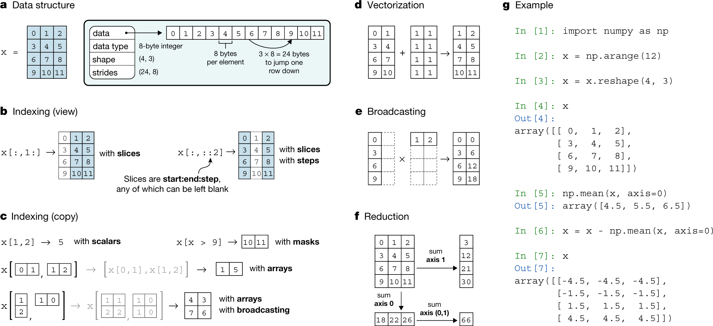
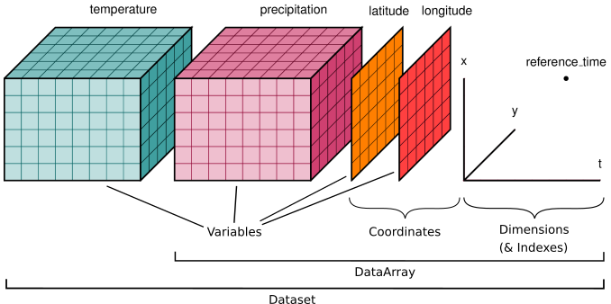

# Importation et manipulation de données spatiales {#sec-chap01}

## Préambule

Assurez-vous de lire ce préambule avant d'exécuter le reste du notebook.

### Objectifs 

Dans ce chapitre, nous abordons quelques formats d'images ainsi que leur lecture. Ce chapitre est aussi disponible sous la forme d'un notebook Python:

[](https://colab.research.google.com/github/sfoucher/TraitementImagesPythonVol1/blob/main/notebooks/01-ImportationManipulationImages.ipynb)

::::: bloc_objectif
:::: bloc_objectif-header
::: bloc_objectif-icon
:::

**Objectifs d'apprentissage visés dans ce chapitre**
::::

À la fin de ce chapitre, vous devriez être en mesure de :

-   connaître les principales bibliothèques Python pour lire une image;
-   accéder à l'information d'une image avant de la lire;
-   comprendre les principaux formats pour une image;
-   manipuler la matrice de la donnée d'une image avec `numpy`;
-   sélectionner et réorganiser des bandes par **indexation avancée** (tableaux d'indices, `argmax`);
-   exclure les pixels non valides à l'aide de **tableaux masqués** (`numpy.ma`);
-   **sauvegarder et recharger** des tableaux au format binaire (`.npy`, `.npz`);
-   **découper** et **rééchantillonner** une image géoréférencée (`clip_box`, `reproject`);
-   sélectionner et calculer par **étiquette** avec `xarray` (dimensions nommées);
-   écrire un résultat dans un **GeoTIFF géoréférencé** (`rasterio`, profil / transformation affine);
-   exploiter les métadonnées et la géoréférence avec `rioxarray` et `xarray`.
:::::


### Bibliothèques

Les bibliothèques qui vont être explorées dans ce chapitre sont les suivantes:

-   [SciPy](https://scipy.org/)

-   [NumPy](https://numpy.org/)

-   [opencv-python · PyPI](https://pypi.org/project/opencv-python/)

-   [scikit-image](https://scikit-image.org/)

-   [Rasterio](https://rasterio.readthedocs.io/en/stable/)

-   [Xarray](https://docs.xarray.dev/en/stable/)

-   [rioxarray](https://corteva.github.io/rioxarray/stable/index.html)

Dans l'environnement Google Colab, seul `rioxarray` et `gdal` doivent être installés:

```{python}
#| eval: false
!apt-get update
!apt-get install gdal-bin libgdal-dev
!pip install -q rioxarray xrscipy geopandas leafmap mapclassify
```

Vérifier les importations:

```{python}
import numpy as np
import rioxarray as rxr
from scipy import signal
import xarray as xr
import xrscipy
import matplotlib.pyplot as plt
```

### Données

Nous utilisons ces images dans ce chapitre:

```{python}
#| eval: false
import gdown

gdown.download('https://drive.google.com/uc?export=download&confirm=pbef&id=1a6Ypg0g1Oy4AJt9XWKWfnR12NW1XhNg_', output= 'RGBNIR_of_S2A.tif')
gdown.download('https://drive.google.com/uc?export=download&confirm=pbef&id=1a4PQ68Ru8zBphbQ22j0sgJ4D2quw-Wo6', output= 'landsat7.tif')
gdown.download('https://drive.google.com/uc?export=download&confirm=pbef&id=1_zwCLN-x7XJcNHJCH6Z8upEdUXtVtvs1', output= 'berkeley.jpg')
gdown.download('https://drive.google.com/uc?export=download&confirm=pbef&id=1yGwNeGlRFtyRylFsyKrrh8IZK_YZd012', output= 'AD_Sherbrooke.zip')
!unzip -o AD_Sherbrooke.zip
!wget https://raw.githubusercontent.com/sfoucher/TraitementImagesPythonVol1/refs/heads/main/images/modis-aqua.PNG -O modis-aqua.PNG
```

Vérifiez que vous êtes capable de les lire:

```{python}
#| output: false

with rxr.open_rasterio('berkeley.jpg', mask_and_scale= True) as img_rgb:
    print(img_rgb)
with rxr.open_rasterio('RGBNIR_of_S2A.tif', mask_and_scale= True) as img_rgbnir:
    print(img_rgbnir)
```

## Importation d'images

La première étape avant tout traitement est d'accéder à la donnée image pour qu'elle soit manipulée par le langage Python. L'imagerie satellite présente certains défis notamment en raison de la taille parfois très importante des images. Il existe maintenant certaines bibliothèques, comme [Xarray](https://docs.xarray.dev/en/stable/), qui visent à optimiser la lecture et l'écriture de grandes images. Il est donc conseillé de toujours garder un oeil sur l'espace mémoire occupé par les variables Python représentant les images. La librairie principale en géomatique qui permet d'importer (et d'exporter) de l'imagerie est la librairie [GDAL](https://gdal.org) qui rassemble la plupart des formats sous forme de *driver* (ou pilote en français).

Dans le domaine de la géomatique, il faut prêter attention à quatre caractéristiques principales des images:

1\. **La matrice des données** elle-même qui contient les valeurs brutes des pixels. Cette matrice sera souvent un cube à trois dimensions. En Python, ce cube sera le plus souvent un objet de la librairie [NumPy](https://numpy.org/) (voir la section « Manipulation de la matrice de pixels » plus bas).

2\. **La dynamique des images** c.-à.-d le format de stockage des valeurs individuelles (octet, entier, double, etc.). Ce format décide principalement de la résolution radiométrique et des valeurs minimales et maximales supportées.

3\. **Le nombre de bandes** spectrales de l'image qui est souvent supérieur à trois et peut atteindre plusieurs centaines de bandes pour certains capteurs (notamment hyperspectraux).

4\. **La métadonnée** qui va transporter l'information auxiliaire de l'image comme les dimensions et la position de l'image, la date, etc. Cette donnée auxiliaire prendra souvent la forme d'un dictionnaire Python. Elle contiendra aussi l'information de géoréférence.

Les différents formats se distinguent principalement sur la manière dont ces quatre caractéristiques sont gérées.

### Formats des images

Il existe de nombreux formats numériques pour la donnée de type image parfois appelé donnée matricielle ou donnée *raster*. La librairie GDAL rassemble la plupart des formats matriciels rencontrés en géomatique (voir [Raster drivers — GDAL documentation](https://gdal.org/en/latest/drivers/raster/index.html) pour une liste complète).

On peut distinguer deux grandes familles de format:

1\. Les formats de type **RVB** issus de l'imagerie numérique grand public comme [JPEG](https://gdal.org/en/latest/drivers/raster/jpeg.html#raster-jpeg), [png](https://gdal.org/en/latest/drivers/raster/png.html#raster-png), etc. Ces formats ne supportent généralement que trois bandes au maximum (rouge, vert et bleu) et des valeurs de niveaux de gris entre 0 et 255 (format dit 8 bits ou `uint8`).

2\. **Les géo-formats** issus des domaines scientifiques ou techniques comme GeoTIFF, HDF5, NetCDF, etc. qui peuvent inclure plus que trois bandes et des dynamiques plus élevées (16 bits ou même float).

Les formats RVB restent très utilisés en Python notamment par les bibliothèques dites de vision par ordinateur (*Computer Vision*) comme OpenCV et scikit-image ainsi que les grandes bibliothèques en apprentissage profond (PyTorch, Tensorflow).

:::::: bloc_package
:::: bloc_package-header
::: bloc_package-icon
:::

**Installation de gdal dans un système Linux**
::::

::: bloc_package-body
-   Pour installer GDAL :

```         
!apt-get update
!apt-get install gdal-bin libgdal-dev
```
:::
::::::

#### Formats de type RVB

Les premiers formats pour de l'imagerie à une bande (monochrome) et à trois bandes (image couleur rouge-vert-bleu) sont issus du domaine des sciences de l'ordinateur. On trouvera, entre autres, les formats pbm, png et jpeg. Ces formats supportent peu de métadonnées et sont placées dans un entête (*header*) très limité. Cependant, ils restent très populaires dans le domaine de la vision par ordinateur et sont très utilisés en apprentissage profond en particulier. Pour la lecture des images RVB, on peut utiliser les bibliothèques Rasterio, [PIL](https://he-arc.github.io/livre-python/pillow/index.html) ou [OpenCV](https://docs.opencv.org/4.10.0/index.html).

##### Lecture avec la librairie PIL

La librairie PIL retourne un objet de type `PngImageFile`, l'affichage de l'image se fait directement dans la cellule de sortie.

```{python}
from PIL import Image
img = Image.open('modis-aqua.PNG')
img
```

##### Lecture avec la librairie OpenCV

La librairie [OpenCV](https://docs.opencv.org/4.10.0/index.html) est aussi très populaire en vision par ordinateur. La fonction `imread` donne directement un objet de type NumPy en sortie.

```{python}
import cv2
img = cv2.imread('modis-aqua.PNG')
img
```

Attention : la fonction `imread` d'OpenCV renvoie les canaux dans l'ordre **BGR** (bleu, vert, rouge) et non RGB. Il faut convertir l'image avant de l'afficher correctement avec `matplotlib` :

```{python}
import matplotlib.pyplot as plt

img_bgr = cv2.imread('modis-aqua.PNG')
img_rgb = cv2.cvtColor(img_bgr, cv2.COLOR_BGR2RGB)   # BGR -> RGB

fig, ax = plt.subplots(1, 2, figsize=(8, 4))
ax[0].imshow(img_bgr); ax[0].set_title("Sans conversion (BGR)"); ax[0].axis('off')
ax[1].imshow(img_rgb); ax[1].set_title("Après conversion (RGB)"); ax[1].axis('off')
plt.show()
```

##### Lecture avec la librairie RasterIO

Rien ne nous empêche de lire une image de format RVB avec [RasterIO](https://rasterio.readthedocs.io/en/stable/) comme décrit dans ci-dessous. Vous noterez cependant les avertissements concernant l'absence de géoréférence pour ce type d'image.

```{python}
import rasterio
img= rasterio.open('modis-aqua.PNG')
img
```

#### Le format GeoTiff

Le format GeoTIFF est une extension du format TIFF (Tagged Image File Format) qui permet d'incorporer des métadonnées géospatiales directement dans un fichier image. Développé initialement par Dr. Niles Ritter au Jet Propulsion Laboratory de la [NASA](https://www.earthdata.nasa.gov/esdis/esco/standards-and-practices/geotiff){target="_blank"} dans les années 1990, GeoTIFF est devenu un standard de facto pour le stockage et l'échange d'images géoréférencées dans les domaines de la télédétection et des systèmes d'information géographique (SIG). Ce format supporte plus que trois bandes aussi longtemps que ces bandes sont de même dimension.

Le format GeoTIFF est très utilisé et est largement supporté par les bibliothèques et logiciels géospatiaux, notamment [GDAL](https://gdal.org) (*Geospatial Data Abstraction Library*), qui offre des capacités de lecture et d'écriture pour ce format. Cette compatibilité étendue a contribué à son adoption généralisée dans la communauté géospatiale.

##### Standardisation par l'OGC

Le standard GeoTIFF proposé par l'Open Geospatial Consortium (OGC) en 2019 formalise et étend les spécifications originales du format GeoTIFF, offrant une norme robuste pour l'échange d'images géoréférencées. Cette standardisation, connue sous le nom d'OGC GeoTIFF 1.1 [-@OGCGeoTIFF], apporte plusieurs améliorations et clarifications importantes.

#### Le format COG

Une innovation récente dans l'écosystème GeoTIFF est le format *Cloud Optimized GeoTIFF* ([COG](http://cogeo.org/)), conçu pour faciliter l'utilisation de fichiers GeoTIFF hébergés sur des serveurs web HTTP. Le COG permet aux utilisateurs et aux logiciels d'accéder à des parties spécifiques du fichier sans avoir à le télécharger entièrement, ce qui est particulièrement utile pour les applications basées sur l'infonuagique.

### Métadonnées des images

La manière la plus directe d'accéder à la métadonnée d'une image est d'utiliser les commandes [`rio info`](https://rasterio.readthedocs.io/en/stable/cli.html#info) de la librairie Rasterio ou `gdalinfo` de la librairie `gdal`. Le résultat est imprimé dans la sortie standard ou sous forme d'un dictionnaire Python.

```{python}
!gdalinfo RGBNIR_of_S2A.tif
```

Le plus simple est d'utiliser la fonction `rio info`:

```{python}
#| eval: false
!rio info RGBNIR_of_S2A.tif --indent 2 --verbose
```

Depuis Python, `rasterio` donne accès à ces mêmes informations sous forme d'attributs et d'un dictionnaire de métadonnées :

```{python}
import rasterio

with rasterio.open('RGBNIR_of_S2A.tif') as src:
    print("Nombre de bandes :", src.count)
    print("Dimensions (lignes, colonnes) :", src.height, src.width)
    print("Type des pixels :", src.dtypes[0])
    print("Système de coordonnées :", src.crs)
    print("Résolution (m) :", src.res)
    print("Emprise :", src.bounds)
    meta = src.meta            # toutes les métadonnées dans un dictionnaire
meta
```

## Manipulation des images

### Manipulation de la matrice de pixels

La donnée brute de l'image est généralement contenue dans un cube matricielle à trois dimensions (deux dimensions spatiales et une dimension spectrale). Comme exposé précédemment, la librairie dite *"fondationnelle"* pour la manipulation de matrices en Python est [NumPy](https://numpy.org/). Cette librairie contient un nombre très important de fonctionnalités couvrant l'algèbre linéaire, les statistiques, etc.; elle constitue la fondation de nombreuses bibliothèques en traitement numérique (voir (@fig-naturenumpy1))

![La librairie NumPy est le fondement de nombreuses bibliothèques scientifiques (d'après [@NumpyNature]).](images/41586_2020_2649_Fig2_HTML.png){#fig-naturenumpy1 width="100%" fig-align="center"}

### Information de base

Les deux informations de base à afficher sur une matrice sont 1) les dimensions de la matrice et 2) le format de stockage (le type). Pour cela, on peut utiliser le code ci-dessous, dont le résultat nous informe que la matrice a trois dimensions et une taille de `(442, 553, 3)` et un type `uint8` qui représente 1 octet (8 bit). Par conséquent, la matrice a `442` lignes, `553` colonnes et `3` canaux ou bandes. Il faut prêter une attention particulière aux valeurs minimales et maximales tolérées par le type de la donnée comme indiqué dans le (@tbl-numpytype) (voir aussi [Data types — NumPy v2.1 Manual](https://numpy.org/doc/stable/user/basics.types.html)).

```{python}
import cv2
img = cv2.imread('modis-aqua.PNG')
print('Nombre de dimensions: ',img.ndim)
print('Dimensions de la matrice: ',img.shape)
print('Type de la donnée: ',img.dtype)
```

```{python}
#| echo: false
#| label: tbl-numpytype
#| tbl-cap: "Type de données de NumPy"

from IPython.display import Markdown
from tabulate import tabulate
table = [["uint8",   "unsigned char",  8,  0,           255],
         ["int8",    "signed char",    8, -128,         127],
         ["uint16",  "unsigned short", 16, 0,           65535],
         ["int16",   "short",          16, -32768,      32767],
         ["uint32",  "unsigned int",   32, 0,           4294967295],
         ["int32",   "int",            32, -2147483648, 2147483647],
         ["float32", "float",          32, "-3.4e38",   "3.4e38"],
         ["float64", "double",         64, "-1.8e308",  "1.8e308"]]
Markdown(tabulate(table, headers=["dtype", "Nom", "Taille (bits)", "Min", "Max"], tablefmt="pipe"))
```

### Découpage et indexation de la matrice

L'indexation et le découpage (*slicing*) des matrices dans NumPy sont des techniques essentielles pour manipuler efficacement les données multidimensionnelles en Python, offrant une syntaxe puissante et flexible pour accéder et modifier des sous-ensembles spécifiques d'éléments dans les tableaux (voir @fig-naturenumpy2). Indexer une matrice consiste à accéder à une valeur dans la matrice pour une position particulière, la syntaxe générale est `matrice[ligne, colonne, bande]` et est similaire à la manipulation des [listes](https://docs.python.org/fr/3/tutorial/introduction.html#lists) en Python. Les indices commencent à `0` et se terminent à la `taille-1` de l'axe considéré.

{#fig-naturenumpy2 width="100%" fig-align="center"}

Le découpage (ou *slicing* en anglais) consiste à produire une nouvelle matrice qui est un sous-ensemble de la matrice d'origine. Un découpage se fait avec le symbole ':', la syntaxe générale pour définir un découpage est `[début:fin:pas]`. Si on ne spécifie pas `début` ou `fin` alors les valeurs 0 ou `dimension-1` sont considérées implicitement. Quelques exemples :

-   choisir un pixel en particulier avec toutes les bandes : `matrice[1, 1, :]`;
-   choisir la troisième colonne (indice 2) avec toutes les bandes : `matrice[:, 2, :]`.

La syntaxe de base pour le découpage (*slicing*) des tableaux NumPy repose sur l'utilisation des deux-points (`:`) à l'intérieur des crochets d'indexation. Cette notation permet de sélectionner des plages d'éléments de manière concise et intuitive. La structure générale du découpage est `matrice[start:stop:step]`, où : 1. `start` représente l'index de départ (inclus) 2. `stop` indique l'index de fin (exclu) 3. `step` définit l'intervalle entre chaque élément sélectionné

Si l'un de ces paramètres est omis, NumPy utilise des valeurs par défaut : 0 pour `start`, la taille du tableau pour `stop`, et 1 pour `step`. Par exemple, pour un tableau unidimensionnel `array`, on peut extraire les éléments du deuxième au quatrième avec `array[1:4]`. Pour sélectionner tous les éléments à partir du troisième, on utiliserait `array[2:]`. Cette syntaxe s'applique également aux tableaux multidimensionnels, où chaque dimension est séparée par une virgule. Ainsi, pour une matrice 2D m, `m[0:2, 1:3]` sélectionnerait une sous-matrice 2x2 composée des deux premières lignes et des deuxième et troisième colonnes. L'indexation négative est également supportée, permettant de compter à partir de la fin du tableau. Par exemple, `a[-3:]` sélectionnerait les trois derniers éléments d'un tableau.

```{python}
import cv2
img = cv2.imread('modis-aqua.PNG')
img_col = img[:,2,:]   # troisième colonne (indice 2), toutes les bandes
print('Nombre de dimensions: ',img_col.ndim)
print('Dimensions de la matrice: ',img_col.shape)
```

:::::: bloc_aller_loin
:::: bloc_aller_loin-header
::: bloc_aller_loin-icon
:::

**Une vue versus une copie**
::::

::: bloc_aller_loin-body
Avec NumPy, les manipulations peuvent créer des vues ou des copies. Une vue est une simple représentation de la même donnée originale alors qu'une copie est un nouvel espace mémoire.

Par défaut, un découpage créé une vue.

On peut vérifier si l'espace mémoire est partagé avec `np.shares_memory(arr, slice_arr)`.

On peut toujours forcer une copie avec la méthode `copy()`
:::
::::::

```{=html}
<!--
#### Exemple 1: calcul d'un rapport de bande

#### Exemple 2: application d'un filtrage spatial

### Mosaïquage, masquage et découpage
-->
```

### Indexation avancée

Au-delà du découpage, NumPy permet de sélectionner des éléments à l'aide de **tableaux d'indices** (*fancy indexing*) : on peut choisir une liste de bandes dans un ordre arbitraire, ou récupérer une valeur différente pour chaque pixel. Contrairement au découpage, l'indexation avancée renvoie toujours une **copie**.

```{python}
import numpy as np

# Un indice de bande choisi pour chacun des 3 pixels (3 pixels x 3 bandes)
petit = np.array([[10, 50, 30],
                  [70, 20, 40],
                  [ 5, 15, 90]])
choix = np.array([1, 0, 2])            # bande retenue pour chaque pixel
print(petit[np.arange(3), choix])      # -> [50, 70, 90]
```

Appliqué à une image réelle, ce mécanisme permet de réordonner les bandes, ou de construire une carte de la **bande dominante** (la bande la plus brillante en chaque pixel) grâce à `argmax` le long de l'axe spectral :

```{python}
import rioxarray as rxr

cube = rxr.open_rasterio('RGBNIR_of_S2A.tif').to_numpy()   # (4, lignes, colonnes) ; bandes B, V, R, PIR

# Sélection de bandes par liste d'indices : passage en ordre vrai-couleur (R, V, B)
vraie_couleur = cube[[2, 1, 0]]
print("Bandes réordonnées :", vraie_couleur.shape)

# argmax sur l'axe des bandes : indice de la bande la plus brillante par pixel
bande_dominante = cube.argmax(axis=0)         # (lignes, colonnes), valeurs 0..3
print("Carte des bandes dominantes :", bande_dominante.shape)
print("Bandes présentes :", np.unique(bande_dominante))
```

La bande dominante donne un premier aperçu de la nature des surfaces : le proche-infrarouge (indice 3) domine généralement sur la végétation, tandis que le bleu ou le rouge l'emporte sur l'eau et les surfaces artificielles.

```{python}
#| fig-align: center
import matplotlib.pyplot as plt

fig, ax = plt.subplots(figsize=(6, 5))
im = ax.imshow(bande_dominante, cmap='viridis')
ax.set_title("Bande dominante par pixel (0=B, 1=V, 2=R, 3=PIR)"); ax.axis('off')
fig.colorbar(im, ax=ax, ticks=[0, 1, 2, 3], shrink=0.7)
plt.show()
```

### Masquage

L'utilisation d'un masque est un outil important en traitement d'image car la plupart des images de télédétection contiennent des pixels non valides qu'il faut exclure des traitements (ce que l'on appelle le *no data* en Anglais). Il y a plusieurs raison possibles pour la présence de pixels non valides:

1.  L'image est projetée dans une grille cartographique et certaines zones, généralement situées en dehors de l'empreinte au sol du capteur, sont à exclure.

2.  La présence de nuages que l'on veut exclure.

3.  La présence de pixels erronés dus à des problèmes de capteurs.

4.  La présence de valeurs non numériques (*not a number* ou `nan`)

La librairie NumPy fournit des mécanismes pour exclure automatiquement certaines valeurs. Le module `numpy.ma` permet de créer un tableau masqué où les pixels non valides sont ignorés par les calculs statistiques :

```{python}
import numpy as np

# Une petite image dont la valeur 0 représente le "no data"
img = np.array([[12,  0, 15],
                [ 8, 20,  0],
                [ 0, 21, 23]], dtype=float)

# Masquer les pixels égaux à 0 : ils seront ignorés par les statistiques
img_masque = np.ma.masked_equal(img, 0)
print("Moyenne sans masque :", round(img.mean(), 2))
print("Moyenne avec masque :", round(img_masque.mean(), 2))

# Approche équivalente avec des NaN et les fonctions « nan » de NumPy
img_nan = np.where(img == 0, np.nan, img)
print("Moyenne (nanmean)   :", round(np.nanmean(img_nan), 2))
```

Sur une image réelle, on masque le plus souvent selon un **critère** plutôt qu'une valeur exacte. Ici, on exclut l'eau et les surfaces artificielles (NDVI négatif) pour ne calculer une statistique que sur la végétation. `np.ma.masked_where` masque les pixels remplissant la condition ; `count()` compte les pixels valides et `compressed()` renvoie ces derniers sous forme de tableau 1D :

```{python}
import rioxarray as rxr

img = rxr.open_rasterio('RGBNIR_of_S2A.tif').astype('float32')
rouge, pir = img.sel(band=3).to_numpy(), img.sel(band=4).to_numpy()
ndvi = (pir - rouge) / (pir + rouge)

# Masquer les pixels non végétalisés (NDVI < 0 : eau, bâti)
ndvi_veg = np.ma.masked_where(ndvi < 0, ndvi)
print("Pixels totaux  :", ndvi.size)
print("Pixels valides :", ndvi_veg.count())
print("NDVI moyen (tous)       :", round(float(ndvi.mean()), 3))
print("NDVI moyen (végétation) :", round(float(ndvi_veg.mean()), 3))
```

### Calcul d'un rapport de bandes

Une opération très courante consiste à combiner deux bandes pixel par pixel. Par exemple, un rapport normalisé entre le proche-infrarouge et le rouge met en évidence la végétation (ce type d'indice spectral est approfondi au chapitre @sec-chap03) :

```{python}
import rioxarray as rxr

img = rxr.open_rasterio('RGBNIR_of_S2A.tif').astype('float32')
rouge = img.sel(band=3)     # bande 3 : rouge (ordre des bandes : B, V, R, PIR)
pir   = img.sel(band=4)     # bande 4 : proche-infrarouge

# Rapport normalisé (NIR - Rouge) / (NIR + Rouge)
rapport = (pir - rouge) / (pir + rouge)
print("Forme du rapport :", rapport.shape)
print("Valeurs min/max  :", round(float(rapport.min()), 2), round(float(rapport.max()), 2))
```

### Exportation d'une image

Une image chargée avec `rioxarray` peut être réécrite sur le disque au format GeoTIFF avec `rio.to_raster`, en conservant sa géoréférence :

```{python}
import rioxarray as rxr

img = rxr.open_rasterio('RGBNIR_of_S2A.tif')
# On ne conserve que les trois premières bandes visibles (bleu, vert, rouge)
img_rvb = img.sel(band=[1, 2, 3])
img_rvb.rio.to_raster('RGBNIR_rvb.tif')
print("Image exportée :", tuple(img_rvb.sizes.values()))
```

### Sauvegarde de tableaux NumPy

L'export GeoTIFF conserve la géoréférence, mais on souhaite parfois simplement **mettre de côté un tableau intermédiaire** (un indice calculé, un masque) pour le recharger plus tard sans tout recalculer. NumPy propose pour cela un format binaire propre : `np.save` écrit un tableau unique (`.npy`), tandis que `np.savez_compressed` regroupe plusieurs tableaux nommés dans une archive compressée (`.npz`).

```{python}
import numpy as np
import rioxarray as rxr

img = rxr.open_rasterio('RGBNIR_of_S2A.tif').astype('float32')
rouge, pir = img.sel(band=3).to_numpy(), img.sel(band=4).to_numpy()
ndvi = (pir - rouge) / (pir + rouge)

# Un seul tableau -> fichier .npy
np.save('ndvi.npy', ndvi)
recharge = np.load('ndvi.npy')
print("Rechargement identique :", np.allclose(ndvi, recharge, equal_nan=True))

# Plusieurs tableaux nommés -> archive .npz (compressée)
np.savez_compressed('bandes.npz', rouge=rouge, pir=pir)
archive = np.load('bandes.npz')
print("Tableaux dans l'archive :", list(archive.keys()))
print("Forme de 'pir' :", archive['pir'].shape)
```

Contrairement au GeoTIFF, ces fichiers ne contiennent **ni géoréférence ni métadonnée** : ils ne servent qu'à un stockage temporaire au sein d'une chaîne de traitement Python.

### Créer un raster à partir d'un tableau NumPy

À l'inverse, on souhaite souvent écrire un **résultat** calculé (un indice, un masque, une classification) dans un GeoTIFF **géoréférencé**. Avec `rasterio`, on part du **profil** de l'image source — qui transporte le système de coordonnées, la transformation affine et les dimensions — que l'on adapte au produit dérivé (ici une seule bande en `float32`) :

```{python}
import rasterio
import numpy as np

with rasterio.open('RGBNIR_of_S2A.tif') as src:
    rouge = src.read(3).astype('float32')     # bande 3 : rouge
    pir   = src.read(4).astype('float32')     # bande 4 : proche-infrarouge
    profil = src.profile                        # hérite CRS, transformation, dimensions

ndvi = (pir - rouge) / (pir + rouge)

profil.update(count=1, dtype='float32')         # une seule bande, en float
with rasterio.open('ndvi.tif', 'w', **profil) as dst:
    dst.write(ndvi, 1)                           # écriture dans la bande 1

# Vérification : la géoréférence a bien été conservée
with rasterio.open('ndvi.tif') as check:
    print("CRS :", check.crs, "| bandes :", check.count, "| type :", check.dtypes[0])
```

Lorsqu'il n'y a pas d'image source, on construit la géoréférence de toutes pièces. `from_origin` définit la transformation affine à partir du coin supérieur gauche et de la taille des pixels :

```{python}
from rasterio.transform import from_origin

# Tableau synthétique 100 x 100 et géoréférence construite manuellement
donnee = np.random.default_rng(0).random((100, 100)).astype('float32')
transform = from_origin(500000, 5000000, 10, 10)   # origine (x, y) + pixel de 10 m

with rasterio.open('synthetique.tif', 'w', driver='GTiff', height=100, width=100,
                   count=1, dtype='float32', crs='EPSG:32618', transform=transform) as dst:
    dst.write(donnee, 1)
print("Raster synthétique écrit :", donnee.shape, "| pixel 10 m, EPSG:32618")
```

### Changement de projection cartographique

Une image géoréférencée peut être reprojetée dans un autre système de coordonnées avec `rio.reproject`. `rioxarray` recalcule alors la grille de pixels et met à jour la géoréférence :

```{python}
import rioxarray as rxr

img = rxr.open_rasterio('RGBNIR_of_S2A.tif')
print("CRS d'origine :", img.rio.crs)              # EPSG:32618 (UTM)

# Reprojection en coordonnées géographiques (latitude/longitude)
img_wgs84 = img.rio.reproject("EPSG:4326")
print("Après reprojection :", img_wgs84.rio.crs)
print("Nouvelle forme :", dict(img_wgs84.sizes))
```

### Découpage et rééchantillonnage

Deux opérations géospatiales complètent la reprojection. Le **découpage** (*clip*) extrait une emprise plus petite : `clip_box` prend une boîte englobante exprimée dans le système de coordonnées de l'image, tandis que `rio.clip` accepte une géométrie quelconque (le polygone d'une zone d'intérêt).

```{python}
import rioxarray as rxr

img = rxr.open_rasterio('RGBNIR_of_S2A.tif')
minx, miny, maxx, maxy = img.rio.bounds()
cx, cy = (minx + maxx) / 2, (miny + maxy) / 2
dx, dy = (maxx - minx) / 4, (maxy - miny) / 4

# Découpage sur le quart central de l'image
sous_image = img.rio.clip_box(cx - dx, cy - dy, cx + dx, cy + dy)
print("Forme d'origine :", tuple(img.sizes.values()))
print("Après découpage :", tuple(sous_image.sizes.values()))
```

Le **rééchantillonnage** change la résolution spatiale. `rio.reproject` avec un paramètre `resolution` recalcule la grille de pixels ; on choisit une méthode d'agrégation adaptée — la **moyenne** pour réduire une image continue, le **plus proche voisin** pour une carte de classes :

```{python}
from rasterio.enums import Resampling

# Passage de 10 m à 20 m par moyenne (sous-échantillonnage)
img_20m = img.rio.reproject(img.rio.crs, resolution=20, resampling=Resampling.average)
print("Résolution d'origine     :", img.rio.resolution())
print("Après rééchantillonnage  :", img_20m.rio.resolution(),
      "| forme :", tuple(img_20m.sizes.values()))
```

```{=html}
<!--
### Recalage d'images et co-registration
-->
```

## Données en géoscience

Les données en géoscience contiennent beaucoup de métadonnées et peuvent être composées de différentes variables avec différentes unités, résolution, etc. Ces données sont aussi souvent étiquetées avec des dates sur certains axes, des coordonnées géographiques, des identifiants d'expériences, etc. Par conséquent, utiliser seulement des matrices est souvent incomplet [@xarray-2017].

Calibration, unités, données manquantes, données éparses.

### xarray

[Xarray](https://docs.xarray.dev/en/latest/getting-started-guide/why-xarray.html) est une puissante bibliothèque Python qui améliore les matrices multidimensionnelles de type numpy en y ajoutant des étiquettes, des dimensions, des coordonnées et des attributs. Elle fournit deux structures de données principales : `DataArray` (un tableau étiqueté à n dimensions) et `Dataset` (une base de données de tableaux multidimensionnels en mémoire).

Les caractéristiques principales sont les suivantes:

-   Opérations sur les dimensions nommées au lieu des numéros d'axe

-   Sélection et opérations basées sur les étiquettes

-   Diffusion automatique de tableaux basée sur les noms de dimensions

-   Alignement de type base de données avec des étiquettes de coordonnées

-   Suivi des métadonnées grâce à des dictionnaires Python

#### Avantages

La bibliothèque réduit considérablement la complexité du code et améliore la lisibilité du code pour les applications de calcul scientifique dans divers domaines, notamment la physique, l'astronomie, les géosciences, la bio-informatique, l'ingénierie, la finance et l'apprentissage profond. Elle s'intègre de manière transparente avec NumPy et pandas tout en restant compatible avec l'écosystème Python au sens large.

#### DataArray

Un tableau multidimensionnel étiqueté avec des propriétés clées :

-   `valeurs` : Les données réelles du tableau

-   `dims` : Dimensions nommées (par exemple, « x », « y », « z »)

-   `coords` : Dictionnaire de tableaux étiquetant chaque point

-   `attrs` : Stockage de métadonnées arbitraires

-   `name` : Identifiant facultatif

#### Dataset

Un conteneur de type dictionnaire de `DataArrays` avec des dimensions alignées, contenant :

-   `dims` : Dictionnaire de correspondance entre les noms des dimensions et les longueurs

-   `data_vars` : Dictionnaire des variables du DataArray

-   `coords` : Dictionnaire des variables de coordonnées

-   `attrs` : Stockage des métadonnées

Les principales différences sont les suivantes :

-   `DataArray` contient un seul tableau avec des étiquettes

-   Le `Dataset` contient plusieurs DataArrays alignés.

Ces deux structures prennent en charge les opérations de type dictionnaire et les calculs de coordination tout en conservant les métadonnées.

{#fig-xarray width="80%" fig-align="center"}

#### Exemple avec rioxarray

`rioxarray` ouvre un GeoTIFF directement comme un `DataArray` étiqueté : ses dimensions (`band`, `y`, `x`), ses coordonnées et sa géoréférence sont accessibles via l'accesseur `.rio`. On peut alors sélectionner une bande par son étiquette plutôt que par un numéro d'axe :

```{python}
import rioxarray as rxr

img = rxr.open_rasterio('RGBNIR_of_S2A.tif')
print("Dimensions :", dict(img.sizes))
print("Système de coordonnées :", img.rio.crs)
print("Résolution (m) :", img.rio.resolution())

# Sélection de la bande proche-infrarouge (bande 4) par son étiquette
pir = img.sel(band=4)
print("Bande PIR — forme :", pir.shape, "| valeur maximale :", int(pir.max()))
```

#### Sélection et opérations par étiquette

L'intérêt principal de `xarray` est de travailler par **étiquette** plutôt que par numéro d'axe. On sélectionne une bande par sa position (`isel`) ou par sa valeur (`sel`), et on peut même nommer les bandes pour les désigner explicitement :

```{python}
img = rxr.open_rasterio('RGBNIR_of_S2A.tif')

# Position vs étiquette : la bande PIR est la 4e (étiquette 4, indice 3)
print("sel == isel :", bool((img.sel(band=4) == img.isel(band=3)).all()))

# Nommer les bandes rend la sélection explicite
img_n = img.assign_coords(band=['B', 'V', 'R', 'PIR'])
print("Forme de la bande PIR :", img_n.sel(band='PIR').shape)

# Sélection par coordonnée cartographique (pixel le plus proche)
minx, miny, maxx, maxy = img.rio.bounds()
centre = img.sel(x=(minx + maxx) / 2, y=(miny + maxy) / 2, method='nearest')
print("Valeurs au centre :", centre.values.tolist())
```

Les opérations respectent les **dimensions nommées** : on calcule la moyenne de chaque bande en réduisant selon `y` et `x`, et un calcul entre bandes (comme le NDVI) renvoie un `DataArray` qui **conserve les coordonnées et la géoréférence** :

```{python}
# Moyenne de chaque bande (réduction sur les dimensions spatiales)
print("Moyenne par bande :", img.mean(dim=['y', 'x']).values.round(1).tolist())

# NDVI : le résultat reste un DataArray géoréférencé (dimensions y, x)
ndvi = (img_n.sel(band='PIR') - img_n.sel(band='R')) / (img_n.sel(band='PIR') + img_n.sel(band='R'))
print("NDVI —", "type :", type(ndvi).__name__, "| dimensions :", ndvi.dims)
```

```{=html}
<!--
netcdf, xarray, GRIB.

Données météos, exemple avec SWOT.
-->
```

## Importation de données vectorielles

Jusqu'ici, nous avons manipulé de la donnée **matricielle** (*raster*), c'est-à-dire une grille régulière de pixels. L'autre grande famille de données géospatiales est la donnée **vectorielle** : des entités géométriques discrètes — **points**, **lignes** et **polygones** — auxquelles sont associés des **attributs**. Un réseau routier, des limites administratives ou des points d'échantillonnage sont typiquement stockés sous cette forme, le plus souvent dans un *shapefile* (`.shp`), un *GeoPackage* (`.gpkg`) ou un fichier GeoJSON.

La bibliothèque de référence pour la donnée vectorielle en Python est [GeoPandas](https://geopandas.org/), qui étend les `DataFrame` de `pandas` en y ajoutant une colonne de **géométrie**. Un `GeoDataFrame` se manipule donc exactement comme un tableau `pandas` (filtres, statistiques, jointures), tout en donnant accès aux opérations géométriques (surface, distance, reprojection) et à la géoréférence via l'attribut `.crs`. Pour la visualisation, nous utilisons [leafmap](https://leafmap.org/), qui produit des cartes **interactives** à partir d'un `GeoDataFrame`.

Nous utilisons ici un jeu de données réel : les **aires de diffusion** de la ville de **Sherbrooke** (l'aire de diffusion est la plus petite unité géographique pour laquelle Statistique Canada diffuse ses données de recensement), enrichies de quelques variables socio-démographiques (population de 2021, nombre de logements, densité). Le fichier est un *shapefile* fourni sous forme d'archive compressée (`AD_Sherbrooke.zip`), téléchargé dans le préambule (section [Données]).

### Lecture avec GeoPandas

La fonction `geopandas.read_file` lit la plupart des formats vectoriels — y compris directement une **archive `.zip`** contenant un *shapefile*. Elle retourne un `GeoDataFrame` dont on inspecte le nombre d'entités, le système de coordonnées et le type de géométrie :

```{python}
import geopandas as gpd

ad = gpd.read_file('AD_Sherbrooke.zip')
print("Nombre d'entités :", len(ad))
print("Système de coordonnées :", ad.crs)
print("Type de géométrie :", ad.geom_type.unique().tolist())
ad.head()
```

Chaque ligne est une aire de diffusion (un polygone) décrite par ses attributs : `ADIDU` (l'identifiant unique), `ADpop_2021` (la population en 2021), `ADtlog_202` (le nombre total de logements), `ADrhlog_20` (les logements occupés par des résidents habituels) et `HabKm2` (la densité en habitants par km2). La colonne `geometry` contient la géométrie de chaque entité.

### Requêtes attributaires

Puisqu'un `GeoDataFrame` est un `DataFrame` `pandas`, on sélectionne des entités par **condition sur les attributs** avec la même syntaxe. On peut aussi calculer des statistiques sur les colonnes :

```{python}
# Aires de diffusion les plus densément peuplées (plus de 3000 hab/km2)
denses = ad[ad['HabKm2'] > 3000]
print("Aires denses :", len(denses), "sur", len(ad))
print("Population totale (2021) :", int(ad['ADpop_2021'].sum()))
print("Densité médiane :", round(ad['HabKm2'].median(), 1), "hab/km2")
```

### Géométrie et projection

La colonne de géométrie donne accès aux **opérations spatiales**. Ce jeu de données est projeté en `EPSG:3347` (projection de Statistique Canada, en mètres), ce qui permet de calculer directement des **surfaces**. Comme pour un raster, on reprojette avec `to_crs` — ici vers `EPSG:4326` (latitude/longitude), le système attendu par les fonds de carte web :

```{python}
# Surface de chaque aire à partir de la géométrie (CRS métrique -> km2)
ad['aire_km2'] = ad.geometry.area / 1e6
print("Superficie totale :", round(ad['aire_km2'].sum(), 1), "km2")

# Reprojection en coordonnées géographiques pour la cartographie
ad_wgs = ad.to_crs('EPSG:4326')
print("CRS après reprojection :", ad_wgs.crs)
```

### Visualisation statique

La méthode `.plot` d'un `GeoDataFrame` produit une carte `matplotlib`. En précisant une colonne, on obtient une **carte choroplèthe** ; l'option `scheme='quantiles'` (fournie par `mapclassify`) répartit les valeurs en classes de même effectif :

```{python}
#| fig-align: center
import matplotlib.pyplot as plt

fig, ax = plt.subplots(figsize=(7, 7))
ad.plot(column='HabKm2', scheme='quantiles', k=5, cmap='YlOrRd',
        legend=True, legend_kwds={'title': 'hab/km2', 'fmt': '{:.0f}'},
        edgecolor='0.6', linewidth=0.2, ax=ax)
ax.set_title("Densité de population — aires de diffusion de Sherbrooke")
ax.axis('off')
plt.show()
```

### Visualisation interactive avec leafmap

Pour explorer la donnée de façon **interactive** (zoom, déplacement, fonds de carte), `leafmap` ajoute un `GeoDataFrame` à une carte web avec `add_data`. On réutilise les mêmes paramètres de classification que pour la carte statique. La carte ci-dessous n'apparaît que dans la **version HTML** du livre :

```{python .content-visible when-format="html"}
import leafmap.foliumap as leafmap

m = leafmap.Map(center=[45.40, -71.90], zoom=11)
m.add_data(ad_wgs, column='HabKm2', scheme='Quantiles', k=5, cmap='YlOrRd',
           legend_title='hab/km2', layer_name='Densité de population')
m
```

::: {.content-visible when-profile="production"}
La carte interactive `leafmap` n'est visible que dans la version HTML du livre.
:::

## Points clés

:::::: bloc_notes
:::: bloc_notes-header
::: bloc_notes-icon
:::

**À retenir**
::::

::: bloc_notes-body
-   **GDAL** est la librairie de référence pour lire/écrire l'imagerie (elle rassemble les formats sous forme de *drivers*).
-   Deux familles de formats : **RVB** (JPEG, PNG — au plus 3 bandes, 8 bits, peu de métadonnées) et **géo-formats** (GeoTIFF, NetCDF, HDF5 — multi-bandes, 16 bits/float, géoréférence). Le **COG** permet l'accès partiel à distance.
-   Quatre caractéristiques à surveiller : la **matrice de pixels**, la **dynamique** (`dtype`), le **nombre de bandes** et les **métadonnées / géoréférence**.
-   Consulter les **métadonnées avant de lire** (`rio info`, `gdalinfo`, ou les attributs de `rasterio`).
-   `OpenCV` lit les canaux en **BGR** : convertir en RGB (`cv2.cvtColor`) avant l'affichage.
-   Une image est un **tableau NumPy** : indexation/découpage `[ligne, colonne, bande]` ; attention à la distinction **vue vs copie** (`np.shares_memory`, `.copy()`).
-   L'**indexation avancée** (tableaux d'indices, `argmax(axis=…)`) sélectionne des éléments par condition ou construit des cartes dérivées (bande dominante) — elle renvoie une **copie**.
-   Les **tableaux masqués** (`numpy.ma`) excluent les pixels non valides des statistiques : `masked_equal`/`masked_where`, puis `count()` et `compressed()`.
-   `np.save` (`.npy`) et `np.savez_compressed` (`.npz`) stockent des tableaux intermédiaires — **sans** géoréférence, au contraire du GeoTIFF.
-   `rioxarray`/`xarray` ajoutent **dimensions nommées, coordonnées et géoréférence** (accesseur `.rio`) : sélection par étiquette, reprojection (`rio.reproject`), export (`rio.to_raster`).
-   `rioxarray` **découpe** (`clip_box`/`clip`) et **rééchantillonne** (`reproject(resolution=…)`, méthode d'agrégation au choix) une image géoréférencée.
-   `xarray` sélectionne par **étiquette** (`sel`) ou position (`isel`), réduit sur des **dimensions nommées**, et ses calculs **préservent la géoréférence**.
-   `rasterio` **écrit** un tableau NumPy dans un GeoTIFF géoréférencé : hériter le **profil** de la source (CRS + transformation) ou le construire (`from_origin`), puis `dst.write`.
:::
::::::

## Exercices

:::::: bloc_exercice
:::: bloc_exercice-header
::: bloc_exercice-icon
:::

**À vous de jouer**
::::

::: bloc_exercice-body
1.  Ouvrez `RGBNIR_of_S2A.tif` avec `rasterio` et affichez son nombre de bandes, son type de pixels, son système de coordonnées et sa résolution.

2.  À l'aide du découpage NumPy, extrayez une fenêtre de 100 × 100 pixels au centre d'une image et affichez-la.

3.  Vérifiez avec `np.shares_memory` si un découpage crée une **vue** ou une **copie**, puis forcez une copie avec `.copy()`.

4.  Reprojetez `RGBNIR_of_S2A.tif` en `EPSG:4326` avec `rioxarray`, puis sauvegardez le résultat en GeoTIFF avec `rio.to_raster`.

5.  *(indexation avancée)* Sur `RGBNIR_of_S2A.tif`, construisez la carte de la **bande dominante** (`argmax`), puis affichez le pourcentage de pixels où le proche-infrarouge (indice 3) domine.

6.  *(masquage)* Calculez le NDVI, masquez les pixels d'eau (NDVI < 0) avec `np.ma.masked_where`, puis comparez le NDVI moyen **avec** et **sans** masque.

7.  *(sauvegarde)* Sauvegardez votre carte de NDVI dans un fichier `.npy`, rechargez-la, et vérifiez l'égalité avec `np.allclose` (option `equal_nan=True`).

8.  *(découpage)* Découpez `RGBNIR_of_S2A.tif` sur son **quart supérieur gauche** avec `clip_box` et affichez la sous-image.

9.  *(rééchantillonnage)* Rééchantillonnez l'image à **30 m** par moyenne (`reproject` avec `Resampling.average`) et comparez le nombre de pixels à l'original.

10. *(xarray)* Nommez les bandes (`B`, `V`, `R`, `PIR`), sélectionnez `PIR` par étiquette, puis calculez la moyenne de chaque bande sur les dimensions `y` et `x`.

11. *(écriture)* Calculez un masque d'eau (NDVI < 0), écrivez-le comme un GeoTIFF à une bande en réutilisant le profil de `RGBNIR_of_S2A.tif`, puis relisez-le pour vérifier son CRS.
:::
::::::

## Quiz

::: {.content-visible when-profile="production"}

Utilisez la version html.
:::

```{python .content-visible when-format="html"}
#| echo: false
#| eval: true
#| results: asis
from code_complementaire.quizz_functions import Quiz, render_quizz
Chap01Quiz = Quiz("quiz/Chap01.yml", "Chap01")
render_quizz(Chap01Quiz)
```