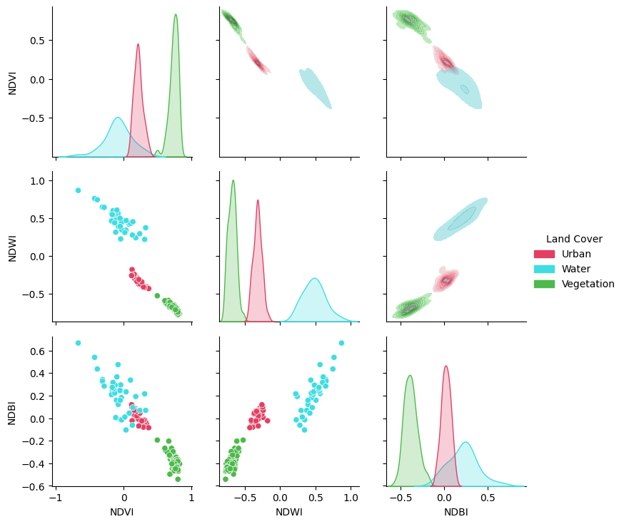

```{python}
#| echo: false
#| output: false
import matplotlib.pyplot as plt
plt.rcParams['axes.titlesize'] = 10
plt.rcParams['axes.labelsize'] = 10
plt.rcParams['xtick.labelsize'] = 10
plt.rcParams['ytick.labelsize'] = 10
plt.rcParams['legend.fontsize'] = 10
plt.rcParams["image.aspect"]= 'equal'
plt.rcParams['figure.dpi'] = 100
import warnings
warnings.filterwarnings('ignore')
```

# Transformations spectrales {#sec-chap03}

## Préambule

Assurez-vous de lire ce préambule avant d'exécuter le reste du notebook.

### Objectifs

Dans ce chapitre, nous abordons l'exploitation de la dimension spectrale des images satellites. Ce chapitre est aussi disponible sous la forme d'un notebook Python:

[](https://colab.research.google.com/github/sfoucher/TraitementImagesPythonVol1/blob/main/notebooks/03-TransformationSpectrales.ipynb)

::::: bloc_objectif
:::: bloc_objectif-header
::: bloc_objectif-icon
:::

**Objectifs d'apprentissage visés dans ce chapitre**
::::

À la fin de ce chapitre, vous devriez être en mesure de :

-   comprendre le principe des indices spectraux;
-   calculer différents indices avec spyndex;
-   analyser le gain en information des indices;
-   réduire la dimension spectrale par **analyse en composantes principales** (produit matriciel, covariance);
:::::

### Librairies

Les librairies qui vont être explorées dans ce chapitre sont les suivantes:

-   [SciPy](https://scipy.org/)

-   [NumPy](https://numpy.org/)

-   [spyindex](https://github.com/awesome-spectral-indices/spyndex)

-   [Rasterio](https://rasterio.readthedocs.io/en/stable/)

-   [Xarray](https://docs.xarray.dev/en/stable/)

-   [rioxarray](https://corteva.github.io/rioxarray/stable/index.html)

Dans l'environnement Google Colab, seul `rioxarray` doit être installé.

```{python}
#| eval: false
%%capture
!pip install -qU matplotlib rioxarray xrscipy scikit-image pyarrow spyndex
```

Vérifiez les importations:

```{python}
import numpy as np
import rioxarray as rxr
from scipy import signal
import xarray as xr
import xrscipy
import matplotlib.pyplot as plt
import spyndex
import rasterio as rio
```

### Images utilisées

Nous utilisons les images suivantes dans ce chapitre:

```{python}
#| eval: false
%%capture
import gdown

gdown.download('https://drive.google.com/uc?export=download&confirm=pbef&id=1a6Ypg0g1Oy4AJt9XWKWfnR12NW1XhNg_', output= 'RGBNIR_of_S2A.tif')
gdown.download('https://drive.google.com/uc?export=download&confirm=pbef&id=1a6O3L_abOfU7h94K22At8qtBuLMGErwo', output= 'sentinel2.tif')
gdown.download('https://drive.google.com/uc?export=download&confirm=pbef&id=1_zwCLN-x7XJcNHJCH6Z8upEdUXtVtvs1', output= 'berkeley.jpg')
gdown.download('https://drive.google.com/uc?export=download&confirm=pbef&id=1dM6IVqjba6GHwTLmI7CpX8GP2z5txUq6', output= 'SAR.tif')
gdown.download('https://drive.google.com/uc?export=download&confirm=pbef&id=1aAq7crc_LoaLC3kG3HkQ6Fv5JfG0mswg', output= 'carte.tif')
gdown.download('https://drive.google.com/uc?export=download&confirm=pbef&id=1iCZNYTv0qEZRzPhe22nPdpV4Ks7NsY3b', output= 'ASCIIdata_splib07b_rsSentinel2.zip')
!unzip -q ASCIIdata_splib07b_rsSentinel2.zip
```

Vérifiez que vous êtes capable de les lire :

```{python}
#| output: false

with rxr.open_rasterio('berkeley.jpg', mask_and_scale= True) as img_rgb:
    print(img_rgb)
with rxr.open_rasterio('RGBNIR_of_S2A.tif', mask_and_scale= True) as img_rgbnir:
    print(img_rgbnir)
with rxr.open_rasterio('sentinel2.tif', mask_and_scale= True) as img_s2:
    print(img_s2)
with rxr.open_rasterio('carte.tif', mask_and_scale= True) as img_carte:
    print(img_carte)
```

## Qu'est ce que l'information spectrale?

L'information spectrale touche à l'exploitation de la dimension spectrale des images (c.à.d le long des bandes spectrales de l'image). La taille de cette dimension spectrale dépend du type de capteurs considéré. Un capteur à très haute résolution spectrale par exemple aura très peu de bandes (4 ou 5). Un capteur multispectral pourra contenir une quinzaine de bande. À l'autre extrême, on trouvera les capteurs hyperspectraux qui peuvent contenir des centaines de bandes spectrales.

)](images/Landsat.v.Sentinel-2-1.png){fig-align="center" width="6in"}

Pour une surface donnée, la forme des valeurs le long de l'axe spectrale caractérise le type de matériau observé ainsi que son état. On parle souvent alors de signature spectrale. On peut voir celle-ci comme une généralisation de la couleur d'un matériau au delà des bandes visibles du spectre. L'exploitation de ces signatures spectrales est probablement un des principes les plus importants en télédétection qui le distingue de la vison par ordinateur. L'[USGS](https://www.sciencebase.gov/catalog/item/586e8c88e4b0f5ce109fccae) maintient une base de données spectrales acquises en laboratoire [@Kokaly-2017]. On peut observer sur la figure ci-dessous comment la forme et l'amplitude de trois signatures différentes peut changer en fonction du type de surface.

```{python}
#| echo: false
#| fig-cap: "Exemples de signatures spectrales pour trois surfaces différentes pour les bandes spectrales de Sentinel-2"
HOME= !pwd
with open(f'{HOME[0]}/ASCIIdata_splib07b_rsSentinel2/S07SNTL2_Wavelengths_Sentinel2_(13_bands)_microns.txt','r') as f:
    # Read all lines, skipping the first line
    lines = f.read().split('\n')[1:]  
    # Filter out empty or whitespace-only lines before converting to float
    band_pos = [float(s.replace(' ', ''))*1000 for s in lines if s.strip()]

with open('ASCIIdata_splib07b_rsSentinel2/ChapterV_Vegetation/S07SNTL2_Rangeland_C03-004_S08%_G27%_ASDFRa_AREF.txt','r') as f:
    lines = f.read().split('\n')[1:]  
    LawnGrass = [float(s.replace(' ', '')) for s in lines if s.strip()]

with open('ASCIIdata_splib07b_rsSentinel2/ChapterL_Liquids/S07SNTL2_Water+Montmor_SWy-2+0.50g-l_ASDFRa_AREF.txt','r') as f:
    lines = f.read().split('\n')[1:]  
    Water = [float(s.replace(' ', '')) for s in lines if s.strip()]


with open('ASCIIdata_splib07b_rsSentinel2/ChapterA_ArtificialMaterials/S07SNTL2_Concrete_GDS375_Lt_Gry_Road_ASDFRa_AREF.txt','r') as f:
    lines = f.read().split('\n')[1:]  
    Concrete = [float(s.replace(' ', '')) for s in lines if s.strip()]
fig, ax= plt.subplots(figsize = (8,5))
plt.plot(band_pos,LawnGrass, 'g.-')
plt.plot(band_pos,Water, 'b.-')
plt.plot(band_pos,Concrete, 'y.-')
plt.legend(['Prairie','Eau','Béton'])
ax.grid('on')
ax.set_xlabel('Longueur d\'onde (nm)')
ax.set_ylabel('Réflectance')
```

## Indices spectraux

Il existe une vaste littérature sur les indices spectraux, le choix d'un indice plutôt qu'un autre dépend fortement de l'application visée, nous allons simplement couvrir les principes de base ici. Le principe d'un indice spectral consiste à mettre en valeur certaines caractéristiques saillantes du spectre comme des pentes, des gradients, etc.

La librairie Python [Awesome Spectral Indices](https://awesome-ee-spectral-indices.readthedocs.io/en/latest/) maintient une liste de plus de 200 indices spectraux (radar et optiques). La liste complète est affichable avec la commande suivante:

```{python}
spyndex.indices
```

Le détail d'un indice particulier, par exemple le \`NDVI\`, est aussi affichable:

```{python}
spyndex.indices["NDVI"]
```

`spyndex` pré-suppose une nomenclature prédéfinie des [bandes](https://awesome-ee-spectral-indices.readthedocs.io/en/latest/#expressions), on peut voir la correspondance sur le tableau ci-dessous:

```{python}
spyndex.bands
```

| Index | Noms | Spyndex | Noms                      |
|-------|------|---------|---------------------------|
| 1     | B01  | A       | Aérosol                   |
| 2     | B02  | B       | Bleu                      |
| 3     | B03  | G       | Vert                      |
| 4     | B04  | R       | Rouge                     |
| 5     | B05  | RE1     | Red edge 1                |
| 6     | B06  | RE2     | Red edge 2                |
| 7     | B07  | RE3     | Red edge 3                |
| 8     | B08  | N       | Proche-infrarouge 1       |
| 9     | B08A | N2      | Proche-infrarouge 2       |
| 10    | B09  | WV      | Vapeur d'eau              |
| 11    | B11  | S1      | Infra-rouge onde courte 1 |
| 12    | B12  | S2      | Infra-rouge onde courte 2 |

: Noms des bandes Sentinel-2

Deux options sont possibles, on peut soit renommer les noms des bandes avec `xarray` ou "mapper" les noms vers les noms appropriés. Regardons les dimensions de notre jeux de données:

```{python}
img_s2.dims
```

On peut simplement changer les index (`coords`) de la dimension `band`:

```{python}
sentinel2_bands= ["A", "B", "G", "R", "RE1", "RE2", "RE3", "N", "N2", "WV", "S1", "S2"]
img_s2 = img_s2.sel(band = list(range(1,13))).assign_coords({'band':sentinel2_bands})
img_s2=img_s2/10000 # normalisation en réflectance
```

Le **NDVI** (*Normalized Difference Vegetation Index*) est l'indice le plus connu. Il se calcule à partir des bandes rouge ($R$) et proche-infrarouge ($N$) :

$$ NDVI = \frac{N - R}{N + R} $$ {#eq-ndvi}

La végétation en bonne santé réfléchit fortement le proche-infrarouge et absorbe le rouge : son NDVI est donc élevé (proche de $1$), alors que l'eau, le sol nu ou le bâti donnent des valeurs faibles, voire négatives. Le `SAVI` ajoute un facteur de correction du sol ($L$) pour limiter l'influence du sol visible à travers un couvert végétal clairsemé.

L'`EVI` (*Enhanced Vegetation Index*) va plus loin en corrigeant également l'effet de l'atmosphère à l'aide de la bande bleue ($B$), ce qui limite la saturation du NDVI sur la végétation dense [@Jensen2016] :

$$ EVI = G \times \frac{N - R}{N + C_1 \times R - C_2 \times B + L} $$ {#eq-evi}

avec les constantes usuelles $G=2{,}5$ (gain), $C_1=6$ et $C_2=7{,}5$ (coefficients de correction atmosphérique appliqués respectivement au rouge et au bleu) et $L=1$ (ajustement du sol). On calcule ces trois indices ci-dessous avec `spyndex.computeIndex` :

```{python}
from rasterio import plot
idx = spyndex.computeIndex(
    index = ["NDVI","SAVI"],
    params = {
        "N": img_s2.sel(band = "N"),
        "R": img_s2.sel(band = "R"),
        "L": 0.5
    }
)

evi = spyndex.computeIndex(
    index = ["EVI"],
    params = {
        "N": img_s2.sel(band = "N"),
        "R": img_s2.sel(band = "R"),
        "B": img_s2.sel(band = "B"),
        "g": 2.5, "C1": 6, "C2": 7.5, "L": 1
    }
)

# Plot the indices (et l'image RGB pour comparaison)
fig, ax = plt.subplots(2,2,figsize = (9,9))
[a.axis('off') for a in ax.flatten()]
plot.show(img_s2.sel(band = ["R","G","B"]).data / 0.3,ax = ax[0,0],title = "RGB")
plot.show(idx.sel(index = "NDVI"),ax = ax[0,1],title = "NDVI")
plot.show(idx.sel(index = "SAVI"),ax = ax[1,0],title = "SAVI")
evi_lo, evi_hi = np.nanpercentile(evi, [2, 98])   # étirement 2-98 %
plot.show(evi,vmin = evi_lo,vmax = evi_hi,ax = ax[1,1],title = "EVI")
plt.tight_layout()
```

On peut vérifier l'utilité des indices en vérifiant leur séparabilité pour certaines classes d'intérêts. Nous reprenons ici l'exemple de la section [@sec-05.02.02] pour vérifier l'utilité des indices `NDVI`, `NDWI` et `NDBI`:

```{python}
#| eval: false
#| echo: false
#| output: false
#| warning: false
from matplotlib.colors import ListedColormap
import rasterio
import geopandas
from shapely.geometry import Point
import pandas as pd

couleurs_classes= {'NoData': 'black', 'Commercial': 'yellow', 'Nuages': 'lightgrey', 
                    'Foret': 'darkgreen', 'Faible_végétation': 'green', 'Sol_nu': 'saddlebrown',
                  'Roche': 'dimgray', 'Route': 'red', 'Urbain': 'orange', 'Eau': 'blue', 'Tourbe': 'salmon', 'Végétation éparse': 'darkgoldenrod', 'Roche avec végétation': 'darkseagreen'}
nom_classes= [*couleurs_classes.keys()]
couleurs_classes= [*couleurs_classes.values()]
cmap_classes = ListedColormap(couleurs_classes)

img_carte= img_carte.squeeze()
class_counts = np.unique(img_carte.data, return_counts=True)

# Liste vide des points échantillonnées
sampled_points = []
class_labels= [] # contient les étiquettes des classes
for class_label in range(1,13): # pour chacune des 12 classes
  # On cherche tous les pixels pour cette étiquette
  class_pixels = np.argwhere(img_carte.data == class_label)

  # On se limite à 100 pixels par classe
  n_samples = min(100, len(class_pixels))

  # On les choisit les positions aléatoirement
  np.random.seed(0) # ceci permet de répliquer le tirage aléatoire
  sampled_indices = np.random.choice(len(class_pixels), n_samples, replace=False)

  # On prends les positions en lignes, colonnes
  sampled_pixels = class_pixels[sampled_indices]

  # On ajoute les points à la liste
  sampled_points.extend(sampled_pixels)
  class_labels.extend(np.array([class_label]*n_samples)[:,np.newaxis])

# Conversion en NumPy array
sampled_points = np.array(sampled_points)
class_labels = np.array(class_labels)
# On peut naviguer les points à l'aide de la géoréférence
transformer = rasterio.transform.AffineTransformer(img_carte.rio.transform())
transform_sampled_points= transformer.xy(sampled_points[:,0], sampled_points[:,1])

points = [Point(xy) for xy in zip(transform_sampled_points[0], transform_sampled_points[1])]
gdf = geopandas.GeoDataFrame(range(1,len(points)+1), geometry=points, crs=img_carte.rio.crs)
coord_list = [(x, y) for x, y in zip(gdf["geometry"].x, gdf["geometry"].y)]
with rasterio.open('sentinel2.tif') as src:
  values = [x[0:13]/10000.0 for x in src.sample(coord_list)]
for b, band in enumerate(sentinel2_bands):
  gdf[band] = [x[b] for x in values]
gdf['class']= class_labels
```

```{python}
#| eval: false
#| warning: false

import pandas as pd
import seaborn as sns

# On sélectionne trois classes
class_selected= [1,3,9]
df= pd.concat([gdf[gdf['class'] ==c] for c in class_selected], ignore_index=True)

# Compute the desired spectral indices
idx = spyndex.computeIndex(
    index = ["NDVI","NDWI","NDBI"],
    params = {
        "N": df["N"],
        "R": df["R"],
        "G": df["G"],
        "S1": df["S1"]
    }
)
idx["Land Cover"] = [nom_classes[l] for l in df["class"].tolist()] # Add Land Cover to DataFrame
colors= [couleurs_classes[c] for c in class_selected]
# Plot a pairplot to check the indices behaviour
plt.figure(figsize = (15,15))
g = sns.PairGrid(idx,hue = "Land Cover",palette = sns.color_palette(colors))
g.map_lower(sns.scatterplot)
g.map_upper(sns.kdeplot,fill = True,alpha = .5)
g.map_diag(sns.kdeplot,fill = True)
g.add_legend()
plt.show()
```

{fig-align="center"}

## Réduction de dimension

La réduction de dimension vise à ne retenir que l'information principale d'un jeu de données. L'objectif est parfois d'éliminer le bruit d'un capteur ou de faciliter la visualisation en ne retenant que 3 bandes principales. Le degré d'information est souvent mesuré par la variance d'une bande, c'est-à-dire son contraste. L'analyse en composantes principales vise alors à ranger l'information contenue dans une image en ordre de variance décroissante.

### Transformations linéaires et produit matriciel

Une **transformation linéaire de bandes** consiste à produire de nouvelles bandes par sommes pondérées des bandes d'origine. Chaque pixel étant un vecteur de valeurs (une par bande), appliquer les mêmes poids à tous les pixels revient à un simple **produit matriciel** (opérateur `@` dans NumPy). Sur un petit exemple, une matrice `M` transforme 2 bandes en 2 nouvelles combinaisons :

```{python}
import numpy as np

# 3 pixels (en lignes), 2 bandes (en colonnes)
pixels = np.array([[10., 40.],
                   [20., 10.],
                   [ 5., 25.]])

# Deux combinaisons de bandes définies par une matrice (2 sorties x 2 bandes)
M = np.array([[0.5, 0.5],     # moyenne des deux bandes
              [1.0, -1.0]])    # différence des deux bandes
print(pixels @ M.T)            # produit matriciel : (3 pixels x 2 sorties)
```

L'analyse en composantes principales pousse cette idée plus loin : au lieu de choisir les poids à la main, elle les **apprend des données** pour maximiser la variance retenue.

### Transformation Tasseled Cap (Kauth-Thomas)

Un exemple historique et toujours largement utilisé de transformation linéaire à coefficients **fixes** (plutôt qu'appris comme en ACP) est la transformation *Tasseled Cap* (ou de Kauth-Thomas), qui combine les bandes réflectives en trois composantes interprétables physiquement : la **brillance** (*brightness*, liée au sol), la **verdure** (*greenness*, liée à la végétation) et l'**humidité** (*wetness*, liée à l'eau du sol et de la végétation) [@Jensen2016; @richards2022remote; @Schowengerdt2007]. Les coefficients ci-dessous, établis par Crist (1985) pour les bandes réflectives de Landsat TM, sont appliqués ici, à titre d'illustration, aux bandes analogues de Sentinel-2 (`B`, `G`, `R`, `N`, `S1`, `S2`) ; chaque capteur possède en pratique ses propres coefficients publiés.

```{python}
# Coefficients de Crist (1985) pour les bandes réflectives Landsat TM (B, G, R, N, S1, S2),
# appliqués ici à titre d'illustration aux bandes analogues de Sentinel-2
tc_coeffs = np.array([
    [ 0.3037,  0.2793,  0.4743,  0.5585,  0.5082,  0.1863],   # Brightness
    [-0.2848, -0.2435, -0.5436,  0.7243,  0.0840, -0.1800],   # Greenness
    [ 0.1509,  0.1973,  0.3279,  0.3406, -0.7112, -0.4572],   # Wetness
])

tc_bands = ["B", "G", "R", "N", "S1", "S2"]
X_tc = img_s2.sel(band=tc_bands).data.reshape(len(tc_bands), -1)   # (6, pixels)
brightness, greenness, wetness = (tc_coeffs @ X_tc).reshape(3, *img_s2.shape[1:])

fig, ax = plt.subplots(ncols=3, figsize=(10, 4))
for a, im, title in zip(ax, (brightness, greenness, wetness),
                         ("Brightness", "Greenness", "Wetness")):
    a.imshow(im)
    a.set_title(title)
    a.axis('off')
plt.tight_layout()
plt.show()
```

Contrairement à l'ACP, ces coefficients ne dépendent pas de l'image : ils permettent donc de comparer directement les composantes entre plusieurs scènes, ce que l'ACP (dont les axes sont recalculés à chaque image) ne permet pas.

### Analyse en composantes principales (ACP)

L'analyse en composantes principales (ACP) est probablement la plus employée. En théorie, l'ACP n'est valide que sur des données gaussiennes, c'est-à-dire que le nuage de points des données a la forme d'une ellipse à $N$ dimensions. Cette ellipse est caractérisée par des directions principales (grand axe versus petit axe). La première composante est celle du grand axe de l'ellipse, pour laquelle la donnée présente le maximum de variation. L'ACP est une décomposition **linéaire** : les composantes principales sont des sommes pondérées des valeurs originales.

Concrètement, on aplatit le cube en une table `pixels × bandes`, on **centre** les données, puis on diagonalise la **matrice de covariance** (`np.linalg.eigh`, adaptée aux matrices symétriques). Les vecteurs propres donnent les directions principales, et les valeurs propres la variance portée par chacune :

```{python}
# On aplatit le cube (bandes x pixels) en une table (pixels x bandes)
cube = img_s2.to_numpy()                 # (12, lignes, colonnes), réflectance
B, H, W = cube.shape
X = cube.reshape(B, H * W).T             # (pixels, bandes)
X_c = X - X.mean(axis=0)                 # centrage : moyenne nulle par bande

# Matrice de covariance (12 x 12), puis vecteurs et valeurs propres
cov = np.cov(X_c, rowvar=False)
valeurs, vecteurs = np.linalg.eigh(cov)          # eigh : matrice symétrique
ordre = np.argsort(valeurs)[::-1]                # variance décroissante
valeurs, vecteurs = valeurs[ordre], vecteurs[:, ordre]

ratio = valeurs / valeurs.sum()
print("Variance expliquée (5 premières) :", ratio[:5].round(3))
print("Cumul des 3 premières composantes :", round(ratio[:3].sum(), 3))
```

La projection des pixels sur les vecteurs propres est, elle aussi, un **produit matriciel**. On récupère ensuite un cube de composantes rangées par variance décroissante :

```{python}
# Projection des pixels sur les directions principales
composantes = (X_c @ vecteurs).T.reshape(B, H, W)   # (composantes, lignes, colonnes)
print("Cube des composantes :", composantes.shape)
```

Les trois premières composantes concentrent l'essentiel de l'information (ici plus de 98 % de la variance). On les visualise sous forme d'un composé coloré, à côté des valeurs propres normalisées (*scree plot* en anglais) des variances :

```{python}
#| fig-align: center
fig, ax = plt.subplots(1, 2, figsize=(10, 4))
ax[0].bar(range(1, B + 1), ratio)
ax[0].set_xlabel("Composante"); ax[0].set_ylabel("Variance expliquée")
ax[0].set_title("Valeurs propres (scree plot)")

# Composé coloré des 3 premières composantes (étirement min-max par composante)
def etirer(x):
    return (x - x.min()) / (x.max() - x.min())
rgb = np.dstack([etirer(composantes[i]) for i in range(3)])
ax[1].imshow(rgb); ax[1].set_title("Composantes 1-2-3 (RGB)"); ax[1].axis('off')
plt.show()
```

La première composante ressemble souvent à une image de brillance globale, tandis que les suivantes isolent des contrastes plus fins (végétation, eau). La même décomposition s'obtient de façon numériquement plus stable par **décomposition en valeurs singulières** (`np.linalg.svd`) appliquée aux données centrées. La réduction de dimension prépare aussi la classification (@sec-chap05) en concentrant l'information utile dans quelques bandes.

### Reconstruction et erreur de compression

Conserver seulement les $k$ premières composantes revient à **compresser** l'image : la reconstruction s'obtient en projetant sur les $k$ premiers vecteurs propres, puis en revenant dans l'espace original (l'opération inverse du produit matriciel de projection). On peut alors mesurer l'erreur de reconstruction (RMSE) en fonction de $k$ [@richards2022remote] :

```{python}
def erreur_reconstruction(k):
    proj_k = composantes[:k].reshape(k, -1).T                  # (pixels, k)
    X_approx = proj_k @ vecteurs[:, :k].T + X.mean(axis=0)      # (pixels, bandes)
    return np.sqrt(np.mean((X - X_approx) ** 2))                # RMSE

erreurs = [erreur_reconstruction(k) for k in range(1, B + 1)]

fig, ax = plt.subplots(figsize=(5, 4))
ax.plot(range(1, B + 1), erreurs, 'o-')
ax.set_xlabel("Nombre de composantes conservées (k)")
ax.set_ylabel("Erreur de reconstruction (RMSE)")
ax.grid(True)
plt.show()
```

L'erreur diminue rapidement avec le nombre de composantes conservées, ce qui confirme que l'essentiel de l'information est capté par les toutes premières composantes — ici, une poignée de composantes suffit à approcher fidèlement les 12 bandes d'origine.

L'ACP suppose une distribution gaussienne des données et ne retient que des combinaisons linéaires classées par variance décroissante, ce qui n'est pas toujours le critère le plus pertinent. La transformation en **fraction de bruit minimum/maximum** (*Minimum/Maximum Noise Fraction*, MNF) classe plutôt les composantes par rapport signal-sur-bruit décroissant, ce qui la rend préférable pour les images hyperspectrales bruitées [@richards2022remote]. L'**analyse en composantes indépendantes** (ICA) relâche quant à elle l'hypothèse gaussienne en recherchant des composantes statistiquement indépendantes plutôt que simplement décorrélées.

## Points clés

:::::: bloc_notes
:::: bloc_notes-header
::: bloc_notes-icon
:::

**À retenir**
::::

::: bloc_notes-body
-   L'**information spectrale** exploite la dimension des bandes ; la **signature spectrale** caractérise le type et l'état d'un matériau — une généralisation de la couleur au-delà du visible.
-   Le nombre de bandes distingue les capteurs : **multispectral** (une quinzaine) vs **hyperspectral** (des centaines).
-   Un **indice spectral** met en valeur des caractéristiques du spectre (pentes, gradients) et améliore la **séparabilité** des classes d'intérêt.
-   La librairie **`spyndex`** (Awesome Spectral Indices) donne accès à plus de 200 indices ; elle suppose une **nomenclature de bandes** (`N`, `R`, `G`, `S1`…).
-   `spyndex.computeIndex` applique un indice à partir des bandes nommées ; renommer les bandes (`assign_coords`) facilite l'usage.
-   Le **NDVI** $= (N - R)/(N + R)$ est élevé pour la végétation dense.
-   Une **transformation linéaire de bandes** est un **produit matriciel** (`@`) ; l'**ACP** apprend les poids optimaux (covariance + vecteurs propres) pour ranger l'information par variance décroissante et **réduire la dimension**.
-   La transformation **Tasseled Cap** (coefficients fixes, comparables entre scènes) et l'ACP (coefficients appris, propres à chaque image) illustrent deux façons de construire une transformation linéaire de bandes ; la **reconstruction tronquée** quantifie la perte d'information selon le nombre de composantes conservées.
:::
::::::

## Exercices

:::::: bloc_exercice
:::: bloc_exercice-header
::: bloc_exercice-icon
:::

**À vous de jouer**
::::

::: bloc_exercice-body
1.  Calculez le **NDWI** (eau) et le **NDBI** (bâti) avec `spyndex` sur `img_s2`, puis affichez-les côte à côte avec le NDVI.

2.  Comparez les **signatures spectrales** de deux surfaces supplémentaires de la base USGS (p. ex. neige, végétation sèche) sur les bandes Sentinel-2.

3.  Parcourez `spyndex.indices`, choisissez un indice adapté à l'eau ou aux sols, identifiez les bandes qu'il requiert, et calculez-le sur `img_s2`.

4.  Renommez les bandes de `img_s2` avec la nomenclature `spyndex` et vérifiez le résultat avec `img_s2.coords['band']`.

5.  *(produit matriciel)* Construisez une matrice `2 × 4` transformant les 4 bandes de `RGBNIR_of_S2A.tif` en deux nouvelles bandes (brillance moyenne et différence PIR - Rouge) à l'aide de l'opérateur `@`, puis affichez-les.

6.  *(ACP)* Réalisez l'ACP de `img_s2`, affichez la **variance expliquée** par chaque composante (éboulis), et vérifiez combien de composantes sont nécessaires pour atteindre 95 % de variance cumulée.

7.  *(Tasseled Cap)* Appliquez la transformation Tasseled Cap à une autre combinaison de bandes (p. ex. en remplaçant `S1` par `RE1`) et comparez visuellement les composantes obtenues à celles de la section.

8.  *(reconstruction)* À partir de l'ACP de `img_s2`, déterminez le nombre minimal de composantes nécessaires pour obtenir une erreur de reconstruction (RMSE) inférieure à 0.01.
:::
::::::

## Quiz

::: {.content-visible when-profile="production"}
Utilisez la version html.
:::

```{python .content-visible when-format="html"}
#| echo: false
#| eval: true 
#| results: asis
from code_complementaire.quizz_functions import Quiz, render_quizz
Chap03Quiz = Quiz("quiz/Chap03.yml", "Chap03")
render_quizz(Chap03Quiz)
#import os
#output_format = os.environ.get("QUARTO_PROFILE")
#print(output_format)
```