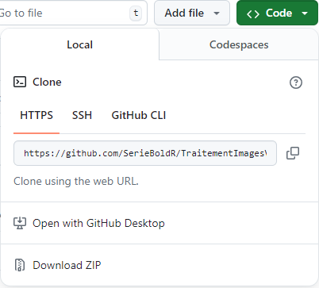

\renewcommand{\partname}{}


**Résumé :** Ce troisième volume de la série aborde le traitement de la donnée géospatiale avec Python par des **applications thématiques** : chaque chapitre part d'un besoin concret (hydrologie, cryosphère, agriculture, environnement urbain, etc.) et déroule la chaîne complète, de l'accès aux données jusqu'à l'interprétation des résultats. Il suppose acquises les bases présentées dans les volumes précédents de la série. La philosophie reste la même : donner toutes les clefs de compréhension et de mise en œuvre dans Python, avec une approche compréhensive et intuitive plutôt que mathématique, sans pour autant négliger la rigueur. Plusieurs éditions régulières sont prévues sachant que ce domaine évolue constamment.

**Ce projet est en cours d'écriture et le contenu n'est pas complet**

{width="50%" fig-align="left"}

**Remerciements :** Ce manuel a été réalisé avec le soutien de la fabriqueREL. Fondée en 2019, la fabriqueREL est portée par divers établissements d'enseignement supérieur du Québec et agit en collaboration avec les services de soutien pédagogique et les bibliothèques. Son but est de faire des ressources éducatives libres (REL) le matériel privilégié en enseignement supérieur au Québec.

**Mise en page :** Samuel Foucher.

© Samuel Foucher, Mélanie Trudel et Victoria Litalien.

**Utilisation de l'IA :** Claude Code a été utilisé pour aider sur certains aspects techniques et de production: gestion de GitHub et des profils quarto, nettoyage des notebook python, vérification du contenu et des fichiers produits, détection des erreurs. 

**Pour citer cet ouvrage :** Foucher S., Trudel M. et Litalien V. (2026). *Traitement de la donnée géospatiale avec Python : applications thématiques*. Université de Sherbrooke, Département de géomatique appliquée. fabriqueREL. Licence CC BY-SA. <br /> <br />

{width="80%" fig-align="left"}

# Préface {.unnumbered}

## Un manuel sous la forme d'une ressource éducative libre {#sect001 .unnumbered}

**Pourquoi un manuel sous licence libre?**

Les logiciels libres sont aujourd'hui très répandus. Comparativement aux logiciels propriétaires, l'accès au code source permet à quiconque de l'utiliser, de le modifier, de le dupliquer et de le partager. Le logiciel Python, dans lequel sont mises en œuvre les méthodes de traitement d'images satellites décrites dans ce livre, est d'ailleurs à la fois un langage de programmation et un logiciel libre (sous la licence publique générale [GNU GPL2](https://fr.wikipedia.org/wiki/Licence_publique_g%C3%A9n%C3%A9rale_GNU)). Par analogie aux logiciels libres, il existe aussi des **ressources éducatives libres (REL)** « dont la licence accorde les permissions désignées par les 5R (**Retenir --- Réutiliser --- Réviser --- Remixer --- Redistribuer**) et donc permet nécessairement la modification » ([***fabriqueREL***](https://fabriquerel.org/rel/)). La licence de ce livre, CC BY-SA (@fig-Licence), permet donc de :

-   **Retenir**, c'est-à-dire télécharger et imprimer gratuitement le livre. Notez qu'il aurait été plutôt surprenant d'écrire un livre payant sur un logiciel libre et donc gratuit. Aussi, nous aurions été très embarrassés que des personnes étudiantes avec des ressources financières limitées doivent payer pour avoir accès au livre, sans pour autant savoir préalablement si le contenu est réellement adapté à leurs besoins.

-   **Réutiliser**, c'est-à-dire utiliser la totalité ou une section du livre sans limitation et sans compensation financière. Cela permet ainsi à d'autres personnes enseignantes de l'utiliser dans le cadre d'activités pédagogiques.

-   **Réviser**, c'est-à-dire modifier, adapter et traduire le contenu en fonction d'un besoin pédagogique précis puisqu'aucun manuel n'est parfait, tant s'en faut! Le livre a d'ailleurs été écrit intégralement dans Python avec [Quatro](https://quarto.org/). Quiconque peut ainsi télécharger gratuitement le code source du livre sur [GitHub](https://github.com/serie-python-tele/TraitementImagesPythonVol3) et le modifier à sa guise (voir l'encadré intitulé *Suggestions d'adaptation du manuel*).

-   **Remixer**, c'est-à-dire « combiner la ressource avec d'autres ressources dont la licence le permet aussi pour créer une nouvelle ressource intégrée » ([***fabriqueREL***](https://fabriquerel.org/rel/)).

-   **Redistribuer**, c'est-à-dire distribuer, en totalité ou en partie le manuel ou une version révisée sur d'autres canaux que le site Web du livre (par exemple, sur le site Moodle de votre université ou en faire une version imprimée).

La licence de ce livre, CC BY-SA (@fig-Licence), oblige donc à :

-   Attribuer la paternité de l'auteur dans vos versions dérivées, ainsi qu'une mention concernant les grandes modifications apportées, en utilisant la formulation suivante :

Samuel Foucher, Mélanie Trudel et Victoria Litalien (2026). *Traitement de la donnée géospatiale avec Python : applications thématiques*. Université de Sherbrooke, Département de géomatique appliquée. fabriqueREL. Licence CC BY-SA.

-   Utiliser la même licence ou une licence similaire à toutes versions dérivées.

{#fig-Licence width="80%" fig-align="center"}

:::::: bloc_astuce
:::: bloc_astuce-header
::: bloc_astuce-icon
:::

**Suggestions d'adaptation du manuel**
::::

::: bloc_astuce-body
Pour chaque méthode de traitement d'image abordée dans le livre, une description détaillée et une mise en œuvre dans Python sont disponibles. Par conséquent, plusieurs adaptations du manuel sont possibles :

-   Conserver uniquement les chapitres sur les méthodes ciblées dans votre cours.

-   En faire une version imprimée et la distribuer aux personnes étudiantes.

-   Modifier la description d'une ou de plusieurs méthodes en effectuant les mises à jour directement dans les chapitres.

-   Insérer ses propres jeux de données dans les sections intitulées *Mise en œuvre dans Python*.

-   Modifier les tableaux et figures.

-   Ajouter une série d'exercices.

-   Modifier les quiz de révision.

-   Rédiger un nouveau chapitre.

-   Modifier des syntaxes en Python. Plusieurs *librairies* Python peuvent être utilisées pour mettre en œuvre telle ou telle méthode. Ces derniers évoluent aussi très vite et de nouvelles *librairies* sont proposées fréquemment! Par conséquent, il peut être judicieux de modifier une syntaxe Python du livre en fonction de ses habitudes de programmation en Python (utilisation d'autres *librairies* que ceux utilisés dans le manuel par exemple) ou de bien mettre à jour une syntaxe à la suite de la parution d'une nouvelle *librairie* plus performante ou intéressante.

-   Toute autre adaptation qui permet de répondre au mieux à un besoin pédagogique.
:::
::::::

## Comment lire ce manuel? {#sect002 .unnumbered}

Le livre comprend plusieurs types de blocs de texte qui en facilitent la lecture.

:::::: bloc_package
:::: bloc_package-header
::: bloc_package-icon
:::

**Bloc *packages***
::::

::: bloc_package-body
Habituellement localisé au début d'un chapitre, il comprend la liste des *packages* Python utilisés pour un chapitre.
:::
::::::

:::::: bloc_objectif
:::: bloc_objectif-header
::: bloc_objectif-icon
:::

**Bloc objectif**
::::

::: bloc_objectif-body
Il comprend une description des objectifs d'un chapitre ou d'une section.
:::
::::::

:::::: bloc_notes
:::: bloc_notes-header
::: bloc_notes-icon
:::

**Bloc notes**
::::

::: bloc_notes-body
Il comprend une information secondaire sur une notion, une idée abordée dans une section.
:::
::::::

:::::: bloc_aller_loin
:::: bloc_aller_loin-header
::: bloc_aller_loin-icon
:::

**Bloc pour aller plus loin**
::::

::: bloc_aller_loin-body
Il comprend des références ou des extensions d'une méthode abordée dans une section.
:::
::::::

:::::: bloc_astuce
:::: bloc_astuce-header
::: bloc_astuce-icon
:::

**Bloc astuce**
::::

::: bloc_astuce-body
Il décrit un élément qui vous facilitera la vie : une propriété statistique, un *package*, une fonction, une syntaxe Python.
:::
::::::

:::::: bloc_attention
:::: bloc_attention-header
::: bloc_attention-icon
:::

**Bloc attention**
::::

::: bloc_attention-body
Il comprend une notion ou un élément important à bien maîtriser.
:::
::::::

:::::: bloc_exercice
:::: bloc_exercice-header
::: bloc_exercice-icon
:::

**Bloc exercice**
::::

::: bloc_exercice-body
Il comprend un court exercice de révision à la fin de chaque chapitre.
:::
::::::

## Comment utiliser les données du livre pour reproduire les exemples? {#sect003 .unnumbered}

Ce livre comprend des exemples détaillés et appliqués en Python pour chacune des méthodes abordées. Ces exemples se basent sur des jeux de données ouverts et mis à disposition avec le livre. Ils sont disponibles sur le *repo GitHub* dans le sous-dossier `data`, à l'adresse <https://github.com/serie-tele-pyton/TraitementImagesPythonVol3/tree/main/data>.

Une autre option est de télécharger le *repo* complet du livre directement sur *GitHub* (<https://github.com/serie-tele-pyton/TraitementImagesPythonVol3>) en cliquant sur le bouton `Code`, puis le bouton `Download ZIP` (@fig-downloaffromgit). Les données se trouvent alors dans le sous-dossier nommé `data`.

{#fig-downloaffromgit width="40%" fig-align="center"}

## Structure du livre {#sect004 .unnumbered}

Le livre est organisé par grandes thématiques d'application, chacune regroupant un ou plusieurs chapitres. D'autres parties viendront s'ajouter au fil des éditions.

**Partie 1. Hydrologie spatiale.** Cette première partie est consacrée au suivi des eaux de surface depuis l'espace. Le chapitre sur la mission **SWOT** ([chapitre @sec-swot]) couvre l'ensemble de la chaîne : la mission et son instrument `KaRIn`, les six produits hydrologiques haute résolution, l'accès aux données avec `earthaccess`, la lecture des produits vectoriels et matriciels, le filtrage par les indicateurs de qualité, l'extraction de séries temporelles avec `Hydrocron`, le tracé de profils en long et la conversion vers les référentiels verticaux canadiens.

## Remerciements {#sect005 .unnumbered}

De nombreuses personnes ont contribué à l'élaboration de ce manuel.

Ce projet a bénéficié du soutien pédagogique et financier de la [***fabriqueREL***](https://fabriquerel.org/) (ressources éducatives libres). Les différentes rencontres avec le comité de suivi nous ont permis de comprendre l'univers des ressources éducatives libres (REL) et notamment leurs [fameux 5R](https://fabriquerel.org/rel/) (Retenir --- Réutiliser --- Réviser --- Remixer --- Redistribuer), de mieux définir le besoin pédagogique visé par ce manuel, d'identifier des ressources pédagogiques et des outils pertinents pour son élaboration. Ainsi, nous remercions chaleureusement les membres de la *fabriqueREL* pour leur soutien inconditionnel :

-   José-Miguel Escobar-Zuniga, bibliothécaire à l'Université de Sherbrooke.

-   Marianne Dubé, coordonnatrice de la fabriqueREL, Université de Sherbrooke.

-   Claude Potvin, conseiller en formation, Service de soutien à l'enseignement, Université Laval.

Nous remercions chaleureusement les personnes étudiantes du [Baccalauréat en géomatique appliquée à l’environnement](https://www.usherbrooke.ca/admission/programme/271/baccalaureat-en-geomatiqueappliquee-a-lenvironnement/ "https://www.usherbrooke.ca/admission/programme/271/baccalaureat-en-geomatiqueappliquee-a-lenvironnement/") et du [Microprogramme de 1er cycle en géomatique appliquée](https://www.usherbrooke.ca/admission/programme/429/microprogramme-de-1er-cycleen-geomatique-appliquee/ "https://www.usherbrooke.ca/admission/programme/429/microprogramme-de-1er-cycleen-geomatique-appliquee/") du [Département de géomatique appliquée](https://www.usherbrooke.ca/geomatique/ "https://www.usherbrooke.ca/geomatique/") de l’[Université de Sherbrooke](https://www.usherbrooke.ca/ "https://www.usherbrooke.ca/") qui utilisent le manuel dans le cadre de cours.

```{=html}
<!--
Nous remercions aussi les membres du comité de révision pour leurs commentaires et suggestions très constructifs. Ce comité est composé de quatre personnes étudiantes du [Département de géomatique appliquée](https://www.usherbrooke.ca/geomatique/) de l'[Université de Sherbrooke](https://www.usherbrooke.ca/) :

-   À compléter plus tard.

-   À compléter plus tard.

Finalement, nous remercions Denise Latreille, réviseure linguistique et chargée de cours à l'Université Sherbrooke, pour la révision du manuel.
-->
```

## Introduction aux images de télédétection {#sect006 .unnumbered}

L'imagerie numérique a pris une place importante dans notre vie de tous les jours depuis une quinzaine d'années. Ces images sont prises généralement au niveau du sol (imagerie proximale) avec seulement trois couleurs dans le domaine de la vision humaine (rouge, vert et bleu). Dans la suite du manuel, on parlera d'images du domaine de la vision par ordinateur ou images en vision pour faire plus court.

Les images de télédétection ont des particularités et des propriétés qui les différencient des images "classiques", dont les cinq principales sont:

1.  Les images sont géoréférencées. Cela signifie que pour chaque pixel nous pouvons y associer une position géographique ou cartographique.

2.  Le point de vue est très différent. Ces images sont prises avec une vue d'en haut (Nadir) ou oblique avec une distance qui peut être très grande; on parle d'images distales.

3.  Elles possèdent plus que 3 bandes. Contrairement aux images en vision, les images de télédétection possèdent bien souvent plus que trois bandes. Il n'est pas rare de trouver quatre bandes (Pléiade), 13 bandes (Sentinel-2, Landsat) et même 200 bandes pour des capteurs hyperspectraux.

4.  Elles peuvent être calibrées. Les valeurs numérique de l'image peuvent être converties en quantités physiques (luminance, réflectance, section efficace, etc.) via une fonction de calibration.

5.  Elles sont de grande taille. Il n'est pas rare de manipuler des images qui font plusieurs dizaines de milliers de pixels en dimension.

### Ressources en ligne {#sect007 .unnumbered}

Voici une sélection de ressources gratuites, en accès libre, pour approfondir les notions abordées dans ce manuel.

**Python et NumPy**

-   [Le tutoriel officiel de Python](https://docs.python.org/fr/3/tutorial/) (en français);
-   [NumPy — the absolute basics for beginners](https://numpy.org/doc/stable/user/absolute_beginners.html);
-   [NumPy Tutorials](https://numpy.org/numpy-tutorials/) — tutoriels appliqués (traitement d'images, algèbre linéaire, etc.);
-   [Python NumPy Tutorial (CS231n, Stanford)](https://cs231n.github.io/python-numpy-tutorial/).

**Données géospatiales et matricielles**

-   [Introduction to GIS Programming (geog-312)](https://geog-312.gishub.org/) — cours complet en Python (`rasterio`, `rioxarray`, `xarray`, `leafmap`…);
-   [Xarray Tutorial](https://tutorial.xarray.dev/intro.html) — le tutoriel officiel de `xarray`;
-   [Documentation de rioxarray](https://corteva.github.io/rioxarray/stable/);
-   [Documentation de Rasterio](https://rasterio.readthedocs.io/en/stable/);
-   [GDAL](https://gdal.org/) — la librairie de référence pour les formats géospatiaux.

**Visualisation**

-   [Tutoriels Matplotlib](https://matplotlib.org/stable/tutorials/index.html);
-   [leafmap](https://leafmap.org/) — cartes interactives pour l'analyse géospatiale.

**Indices spectraux et apprentissage automatique**

-   [Awesome Spectral Indices](https://awesome-ee-spectral-indices.readthedocs.io/) (librairie `spyndex`);
-   [scikit-learn](https://scikit-learn.org/stable/) — apprentissage automatique en Python;
-   [scikit-image](https://scikit-image.org/) — traitement d'images.

### Listes des *librairies* utilisés {#sect0071 .unnumbered}

Dans ce livre, nous utilisons de nombreux *packages* Python. La liste des bibliothèques nécessaires est donnée au début de chaque chapitre, dans le bloc *packages*.